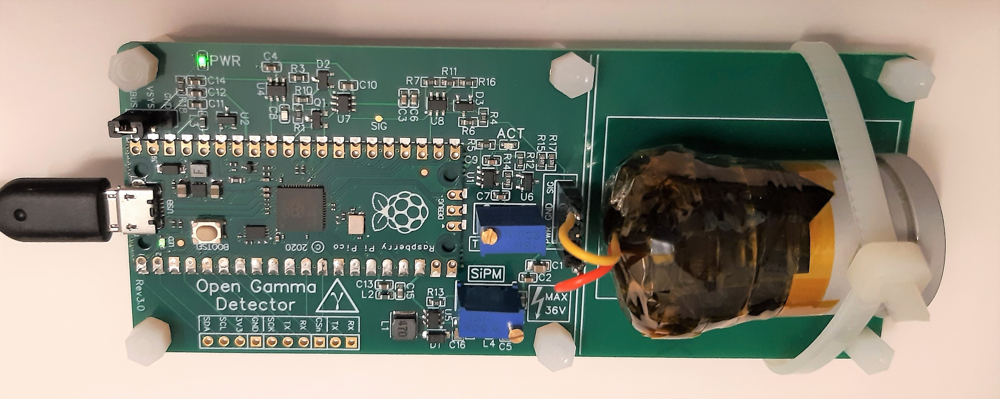
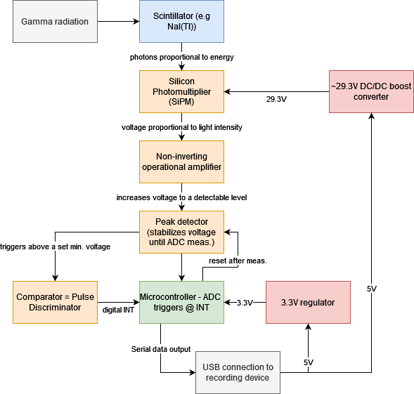
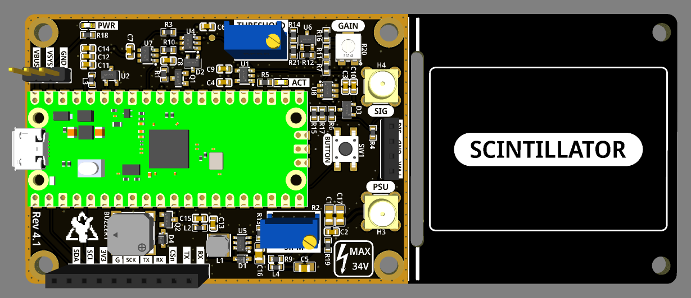
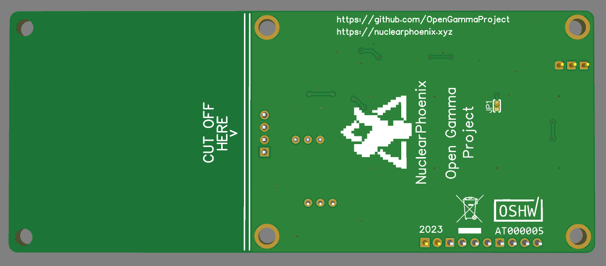
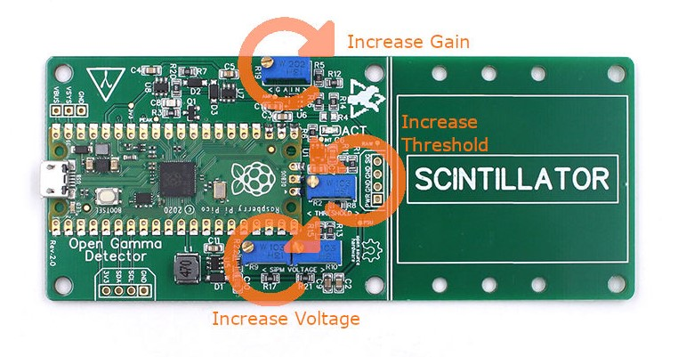

# Open Gamma Detector

__This project is on [Hackaday.io](https://hackaday.io/project/185211-all-in-one-gamma-ray-spectrometer), where I also post project logs, progress updates and other announcements.__

Open hardware for a simple, yet powerful scintillation counter and multichannel analyzer (MCA) all-in-one device using a popular NaI(Tl) scintillation crystal and silicon photomultipliers (SiPMs). Suitable for (DIY) gamma spectroscopy while being significantly cheaper than any off-the-shelf platform. Uses a standard serial-over-USB connection so that it can be integrated into as many other projects as possible, for example data logging with a Raspberry Pi, weather stations, Arduino projects, etc.

Hardware design has been done with [EasyEDA](https://easyeda.com/) and all the needed files for you to import the project as well as the schematic can be found in the `hardware` folder. There is also a Gerber file available for you to go directly to the PCB manufacturing step.

The software aims to be as simple as possible to understand and maintain; to achieve this I decided to use an off-the-shelf microcontroller - the [Raspberry Pi Pico](https://www.raspberrypi.com/products/raspberry-pi-pico/). This board can be programmed with the Arduino IDE over micro-USB and is powerful (dual core, good ADC, plenty of memory, ...) enough for the purpose and also exceptionally cheap.

**-->** For quick access and purchase of all the parts (PCB and BOM) you can use [Kitspace](https://kitspace.org/boards/github.com/open-gamma-project/open-gamma-detector/). In addition, you'll also need to buy a SiPM (e.g. the MICROFC-60035-SMT-TR1) at a distributor of your choice.

**-->** The fully assembled main detector board can also be purchased on the [Makerfabs webshop](https://www.makerfabs.com/open-gamma-detector.html), thanks to my cooperation partner. For this kit you'll then only need to get a separate SiPM and scintillator, everything else is included and assembled :)

  
  

## Specifications

Here are some of the most important key facts:

* Compact design: Total size 120 x 50 mm. 70 x 50 mm area for electronics and additional 50 x 50 mm to mount the scintillator.
* All-in-one detector: No external parts (e.g. sound card) required to record gamma spectra.
* Easily programmable using the standard Arduino IDE or ready-to-use firmware files.
* Low-voltage device: No HV needed for a photomultiplier tube.
* SiPM voltage range from 28 V to 33 V.
* OLED support out of the box.
* Low power consumption: ~15 mA @ 5V in standard operation.
* Adjustable preamp gain for the SiPM pulses (affects energy range & resolution).
* Customizable energy range with 4096 ADC channels.
* Default Mode: Capable of at least around 60,000 cps while also measuring energy.
* Geiger Mode: Capable of at least around 180,000 cps without energy measurement.
* Additional broken-out power pins and I2C header for displays, etc.
* True Random Number Generator

## Working Principle

  

## Hardware

This project utilizes a silicon photomultiplier (short SiPM) which is way smaller and more robust than a traditional photomultiplier tube and does not need a high-voltage supply (traditionally ~1000 V). Here are some very helpful in-depth datasheets about the particular MicroFC SiPM used here:

* [C-Series SiPM Sensors datasheet](https://www.onsemi.com/pdf/datasheet/microc-series-d.pdf)
* [Linearity of the Silicon Photomultiplier](https://www.onsemi.com/pub/Collateral/AND9776-D.PDF)
* [Introduction to the SiliconPhotomultiplier (SiPM)](https://www.onsemi.com/pub/Collateral/AND9770-D.PDF)
* [Biasing and Readout of ON Semiconductor SiPM Sensors](https://www.onsemi.com/pub/Collateral/AND9782-D.PDF)

The hardware consists of the main detector (`hardware` folder) which includes amplification, pulse detection and energy measurement. If you already have a SiPM/crystal assembly compatible with voltages around 30 V, you may use it with the detector board and soldering wires directly to the correct pads. Otherwise, you can use my [SiPM carrier board](https://github.com/Open-Gamma-Project/MicroFC-SiPM-Carrier-Board), which holds the SiPM and all the optimal decoupling.

The heart of the detector board is the Raspberry Pi Pico which uses its ADC to measure the pulse amplitude (i.e. the energy) immediately after an event occurs starting with an interrupt. I can really recommend you reading the datasheet or maybe also having a look at a deeper analysis of the Pico ADC, if you're interested:

* [Raspberry Pi Pico](https://datasheets.raspberrypi.com/pico/pico-datasheet.pdf)
* [Characterizing the Raspberry Pi Pico ADC](https://pico-adc.markomo.me/)

Here are some front and back side renders of the detector PCB. Size is about 12 x 5 cm. If you don't need the additional space to mechanically mount the SiPM/scintillator assembly to the rest of the detector board, you can just cut it off at the white line and you're left with a smaller detector.

  
  

On the back side of the PCB there is place for two optional components:
* a voltage reference for the ADC (LM4040AIM3-3.0+T recommended) to get rid of most power supply related noise and inaccuracy
* and a 0 Ω link to connect the analog ground to the rest of the ground plane.

These can be retrofitted easily and are quite affordable. Both are optional and should only be used if you know what you are doing. You can't really do anything wrong with using the voltage reference, though.

There are also broken-out pins for the power supply and I2C connections. These can be used to modify the device, e.g. by adding a display or using a battery charger. You can have a look at the great [Raspberry Pi Pico datasheet](https://datasheets.raspberrypi.com/pico/pico-datasheet.pdf) for more info on this.

The resistor R4 on the front side is optional as well. It will raise the input voltage of the preamp and therefore also the output so that even lower signals are above the inherent swing of the op amp at a given gain. This way you _might_ be able to read lower energies for a fixed gain up to the SiPM noise. But due to the preamp as well as SiPM gain being variable now and this voltage divider also introducing some noise into the signal I opted to leave this part out by default.

**Here is a helpful image about the potentiometer settings for Rev. 2.0/b:**

### Scintillator Assembly

The finished [MicroFC-](https://github.com/Open-Gamma-Project/MicroFC-SiPM-Carrier-Board) and [AFBR-](https://github.com/Open-Gamma-Project/AFBR-SiPM-Carrier-Board) SiPM carrier boards are there to allow for easier packaging with the scintillator as well as to be reusable for different detectors as that's by far the single most expensive part and you'll want to use it as long as possible. You should apply some optical coupling compound between the SiPM and the crystal window to reduce reflections as good as possible (this way the best photon detection efficiency is achieved). There are also special materials for this use case but you can also use standard silicone grease - works great for me. After you applied some, you press both parts together and wrap everything with light-tight tape, again, I'm just using some black electrical tape here. That's essentially it, now you can solder some wires to the pads on the board to connect them together and secure it in place in the free space on the board. There are holes on each side of the PCB for some cable ties.

I got all of my scintillators (used NaI(Tl), LYSO, ...) on eBay. Just search for some keywords or specific types, you'll probably find something! Otherwise you can obviously also buy brand-new scintillators, however, these are much more expensive (depends, but a factor of 10x is normal). Just be sure to look out for signs of wear and tear like scratches on the window or yellowing (!) in NaI crystals as these can deteriorate performance significantly.

### Shielding

Due to the detector measuring small voltages, energy resolution being limited by noise and a tiny 220 pF capacitor being on board, it is generally pretty sensitive to EMI. In fact, without any shielding and periodically discharging the capacitor, mains electricity would slowly charge it until the device gets overwhelmed with noise. To mitigate this effect, the Arduino sketch is programmed to clear the cap every 500 µs by default, which is enough to mostly fix this issue. However, this adds an additional ~4 ms dead time total per second which could be roughly equivalent to 500 missed events in geiger mode.

For the best performance, you will need to put your detector into a metal enclosure. It doesn't need to be a thick metal case, a tin can will most likely suffice.

### 3D Printed Case

You can get a 3D-printable case for the Open Gamma Detector with different styles of covers.

All the STL files to print the two parts (main body and cover) can be found in [/enclosure](/enclosure), as well as some more info on the necessary screws and the USB extension cable.

## Software

### Setup

#### Raspberry Pi Pico

Programming is done using the Arduino IDE. The so-called "sketch" (i.e. the programmed software) can be found in `/software/opengamma_pico/`.

For convenience there is also a ready-to-use default firmware UF2 located in `/software/`, which is targeted at the standard Open Gamma Detector that you can build using the instructions or buy on the makerfabs store.

##### Firmware File

This is the easiest way to get started! You'll not have to download anything else besides the firmware UF2 file. This is the latest default firmware that you can use if you don't plan to modify any of the hardware aspects (such as the voltage reference, ADC resolution, etc) on the board itself. You can of course also use it with the Open Gamma Detector bought from the makerfabs store.

To get started with a fresh device, plug in the Raspberry Pi Pico via the micro-USB connection. A file manager window should now pop up. Drag and drop the `opengamma_pico-XXX.uf2` file that you downloaded into this directory. The device will restart automatically once the transmission is completed and is ready to use!

If you want to update or re-flash the firmware, press and hold the `BOOTSEL` button on the Raspberry Pi Pico _while_ plugging it in the USB port of your computer. A file manager windows should once again pop up and you can let go of the button. Drag and drop the UF2 file just like above.

##### Arduino IDE

To program the Pico you will need the following board configs in the latest release of the Arduino IDE:

* [Arduino-Pico](https://github.com/earlephilhower/arduino-pico)

The installation and additional documentation can be found in the respective GitHub repo, it's not complicated at all and you only need to do it once. You will also need the following additional libraries:

* [SimpleShell](https://github.com/cafehaine/SimpleShell) 
* [ArduinoJson](https://github.com/bblanchon/ArduinoJson) 
* ~~[Arduino-Pico-Analog-Correction](https://github.com/Phoenix1747/Arduino-Pico-Analog-Correction) ~~

They can be installed by searching their names using the IDE's built-in library manager.

Please have a look at the `USER SETTINGS` in the Arduino sketch. The most important setting here is the `VREF_VOLTAGE`. If you soldered in the voltage reference then this probably needs to be set to `3.0`, otherwise leave `3.3` as is.

Flash the Pico by choosing the `Raspberry Pi Pico` under `Tools/Board/Raspberry Pi RP2040 Boards` and then selecting `Flash Size: 2MB (Sketch: 1984KB, FS: 64KB)`, leaving everything else at the default value. You can then press the big `Upload` button.

### Serial Interface

You can control your spectrometer using the serial interface. The following commands are available, a trailing `-` indicating an additional parameter is needed at the end of the command.

- ``read spectrum`` reads the histogram data of all energy measurements since the last clear (start-up).
- ``read settings`` prints the current settings file contents that are loaded on every boot and changed once you modify any settings.
- ``read info`` prints miscellaneous information about the firmware and the state of the device (e.g., runtime, temperature, memory).
- ``read fs`` prints miscellaneous information about the filesystem used for saving the config.
- ``set trng -`` either `enable` or `disable` to enable the true random number generator output or disable (default) it. Prints random numbers from 0 - 255 to the Serial interface once they are ready.
- ``set display -`` either `enable` or `disable` to enable (default) OLED support or force disable it.
- ``set mode -`` use either `geiger` or `energy` mode to disable or enable energy measurements respectively. Geiger mode only measures counts per second, but has a ~3x higher saturation limit.
- ``set int -`` changes or disables the event serial output. Takes `events`, `spectrum` or `disable` as parameter, e.g. `set int -disable` to disable event outputs. `spectrum` will regularly print the full ready-to-use gamma spectrum. `events` will print all the registered new events in chronological order.
- ``set reset -`` changes or disables a periodic reset of the sample and hold circuit. This is enabled by default to help with mains interference to the capacitor when the detector is not shielded properly. Takes `enable` or `disable` as parameters. Adds an additional 4 ms dead time when enabled.
- ``set averaging -`` changes the number of measurements that get averaged to represent each individual gamma pulse. Parameter needs to be an integer like this: `set averaging -2` sets averaging to 2. Minimum is 1.
- ``clear spectrum`` clears the on-board spectrum and reverts all channels back to zero.
- ``reset settings`` clears all the settings and reverts them back to their default values.
- ``reboot`` reboots the device after one second.

### OLED Support

The detector board features a standard I2C header where you can connect any standard SSD1306 OLED display that will be supported with minimal changes to the Arduino IDE sketch. **A 128 x 64 px OLED is supported as is and will be automatically used upon boot of the device in the current firmware version!** If no display is connected the device will work as usual only via a Serial interface. You can also force the device _not_ to use the display even if one is connected via the I2C header.

At the moment the software only draws the overall energy spectrum and the overall mean cps value on the screen. This is sufficient in most (simple) cases and more features will be implemented over time.

### True Random Number Generator

Radioactive decay is a great source of entropy for a random number generator of course. This device can output true random numbers meaning they are truly, per definition, random, instead of the pseudorandom numbers a PRNG (i.e., an algorithm) can produce. If you enable the TRNG via the serial command, it will periodically (once they are ready) output random numbers between 0 - 255. This could be further used to, for example, periodically re-seed a pseudorandom number generator to increase the overall amount of available numbers to use.

Note that the TRNG uses the same Serial connection as the gamma spectroscopy output, so you have to disable one of them so that you don't mix the outputs. The numbers of both functions are formatted the same for ease of use, i.e. with a semicolon ";" as some kind of "end of data" delimiter.

### Data Analysis

To get the data from the detector the serial-over-USB port is used by default. The quickest and easiest way to do this is by using my own web application called [Gamma MCA](https://spectrum.nuclearphoenix.xyz/) where you can connect straight to the serial port and plot the data live as well as import and export finished spectrum files. You don't even need to install it, it can work out of any Chrome-based browser! Please head to the [repository](https://github.com/Open-Gamma-Project/Gamma-MCA) to find more specific info about this project.

You can of course use any other serial monitor or gamma-spectroscopy software that's compatible with serial connections. There isn't much, though, that's why I made one myself.

## Example Spectra

Here is a small collection of example spectra I could make quickly without putting much effort into the detector settings (gain, threshold, SiPM voltage). In addition, neither the electronics nor the scintillator and sample were shielded whatsoever.

Two hour long background spectrum with no samples:

Spectrum of a tiny (~5 g) LYSO scintillator inside some lead shielding showing all three distinct gamma peaks (88.34, 201.83, 306.78 keV) with an additional ~55 keV X-ray peak (2h measurement):

Spectrum of a standard household ionization smoke detector. Contains roughly 0.9 µCi of Am-241. Gamma peaks at 26.34 and 59.54 keV:

Spectrum of a small tea cup with pure Uraninite (Pitchblende) contents in its glaze. You can see all kinds of isotopes of the Uranium series:

Spectrum of a Na-22 test source, about ~2 µCi. You can see the 511 keV annihilation peak and the small 1275 keV gamma peak (much smaller due to limited NaI efficiency and small scintillator size for this energy):

## Known Limitations

1. The Raspberry Pi Pico's ADC has some pretty [severe DNL issues](https://pico-adc.markomo.me/INL-DNL/#dnl) that result in four channels being much more sensitive (wider input range) than the rest. For now the simplest solution was to discard all four of them, by printing a `0` when any of them comes up in the measurement (to not affect the cps readings). This is by no means perfect or ideal, but it works for now until this gets fixed in a later hardware revision of the RP2040.

2. It's very important to get the SiPM/scintillator assembly light-tight. Otherwise you'll either run into problems with lower energies where noise dominates or outright not measure anything at all, because the sensor is saturating.

3. Due to the global parts shortage many chips are much harder to come by, if at all that is. This is most severe for high-quality op amps and other specialized parts such as the DC/DC converters and the tiny peak detector cap. This makes it much harder for me to choose from components and maybe even limiting the performance. Parts that are listed in the BOM should be available easily and with high reliability and stock so that they don't run out quickly. Notably, this also drives the cost of the detector up by a large factor, again mostly due to the op amps and also the SiPMs.

## Some Ideas

### Coincidence Measurements

Using multiple detector boards with updated firmware should be able to deliver some coincidence measurement features. By respectively connecting the `VSYS`, `GND` and one of the `SCL` or `SDA` pins to each other on both boards you have everything you need to get started. The `SCL` or `SDA` pin will be used for an interrupt from the child detector to the parent to trigger a pulse if both timings coincide. Since you lose the ability to use I2C with this, future detector boards will likely feature an entire new coincidence pin header.

At the moment, though, I couldn't get a coincidence mode feature running due to misc timing issues. There might be a firmware update in the future to implement this feature.

### Cooling the SiPM

During operation all the electronics including the photomultiplier naturally heat up ever so slightly. Due to the detector board being connected to the SiPM only by a single pin connector and/or by touching the PCB, its heat shouldn't affect the SiPM much if at all. Air or water cooling alone won't improve performance considerably, because it won't heat up much above ambient temps. However, you could cool the SiPM PCB with a Peltier module to sub-ambient temperatures. According to the [datasheet AND9770 (Figure 27)](https://www.onsemi.com/pub/Collateral/AND9770-D.PDF) every 10°C reduction in temperature decreases the dark count rate by 50%! But be sure to correct the SiPM voltage (overvoltage) in this case as it also changes with temperature.

Note that the required breakdown voltage of the SiPM increases linearly with 21.5 mV/°C, see the [C-Series SiPM Sensors Datasheet](https://www.onsemi.com/pdf/datasheet/microc-series-d.pdf). This means that you would also need to temperature correct the PSU voltage if you wanted to use it with considerably different temperatures.

### Shielding Background Radiation

Shielding the ambient background can be done ideally using a wide enough layer of lead (bricks) all around the detector with a thin layer of lower-Z material on the inside (to avoid backscattering) such as copper. The SiPM and the sample can then be put into the structure to get the best measurements possible (low background).

See Wikipedia: [Lead Castle](https://en.wikipedia.org/w/index.php?title=Lead_castle&oldid=991799816)

---

Thanks for reading.
