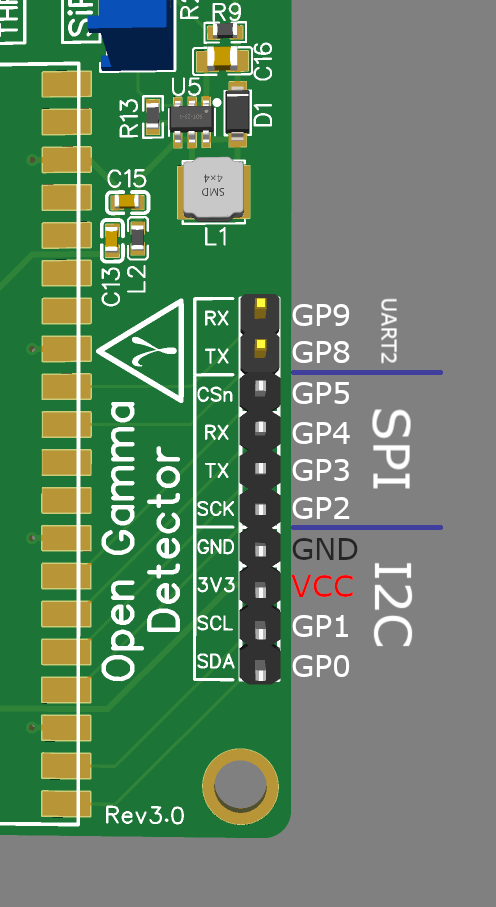
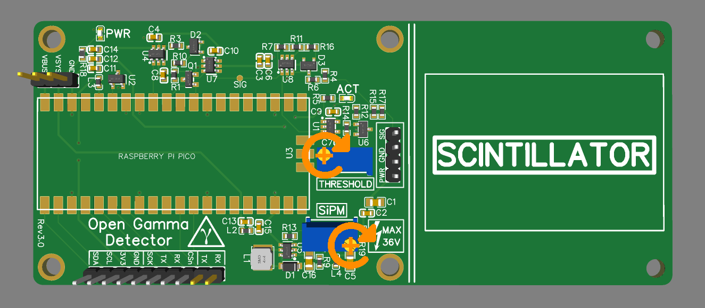

# Hardware

_Here you can find everything you need to build yourself a detector, or more._

This project utilizes a silicon photomultiplier (short SiPM) which is way smaller and more robust than a traditional photomultiplier tube and does not need a high-voltage supply (traditionally ~1000 V).

The following 6 mm SiPMs are recommended for this project:

* **MICROFC-60035-SMT-TR**
* MICROFC-60035-SMT-TR1 (the exact same as above, however will be more expensive to purchase as sold in smaller batches to suppliers)
* AFBR-S4N66C013 (a good replacement if the above are unavailable)

Here are some very helpful in-depth datasheets about the particular MicroFC SiPM recommended here:

* [C-Series SiPM Sensors datasheet](https://www.onsemi.com/pdf/datasheet/microc-series-d.pdf)
* [Linearity of the Silicon Photomultiplier](https://www.onsemi.com/pub/Collateral/AND9776-D.PDF)
* [Introduction to the SiliconPhotomultiplier (SiPM)](https://www.onsemi.com/pub/Collateral/AND9770-D.PDF)
* [Biasing and Readout of ON Semiconductor SiPM Sensors](https://www.onsemi.com/pub/Collateral/AND9782-D.PDF)

The hardware consists of the main detector (hardware in this folder) which includes amplification, pulse detection and energy measurement. If you already have a SiPM/crystal assembly compatible with voltages around 30 V, you may use it with the detector board and connecting wires directly to the correct pads. Otherwise, you can use my [SiPM carrier board](https://github.com/OpenGammaProject/MicroFC-SiPM-Carrier-Board), which holds the SiPM and all the optional decoupling. There is also a carrier board for the Broadcom SiPM.

The heart of the detector board is the Raspberry Pi Pico which uses its ADC to measure the pulse amplitude (i.e. the energy) immediately after an event occurs starting with an interrupt. I can really recommend you reading the datasheet or maybe also having a look at a deeper analysis of the Pico ADC, if you're interested:

* [Raspberry Pi Pico](https://datasheets.raspberrypi.com/pico/pico-datasheet.pdf)
* [Characterizing the Raspberry Pi Pico ADC](https://pico-adc.markomo.me/)

Here are some front and back side renders of the detector PCB. Size is about 120 x 50 mm. If you don't need the additional space to mechanically mount the SiPM/scintillator assembly to the rest of the detector board, you can just cut it off at the white line and you're left with an even smaller detector.

On the back side of the PCB there is also a jumper to connect the analog ground to the rest of the ground plane. You can solder that if you want to, if you know exactly what you're doing. It's not needed, though.

There are also broken-out pins for the power supply, I2C, SPI and UART connections. These can be used to modify the device, e.g. by adding a display or using a battery charger. You can have a look at the great [Raspberry Pi Pico datasheet](https://datasheets.raspberrypi.com/pico/pico-datasheet.pdf) for more info on this.

Some more info on the peripheral headers can be found in the `software` section of this project.

## Pinout

You can also put a little jumper from `VBUS` to `VSYS` if you **only** want to use the detector with the USB connection on the Pico. This bridges a diode on the Raspberry Pi Pico and saves you a couple of mW.

## Potentiometers

Here is a helpful image about the potentiometer settings for revision 3.0, it's not complicated:

As you can see it is pretty easy to set the required voltage and threshold. **As a general rule, turn any potentiometer clockwise to increase the parameters, turn anti-clockwise to decrease.**

## Scintillator (Assembly)

The finished [MicroFC-](https://github.com/OpenGammaProject/MicroFC-SiPM-Carrier-Board) and [AFBR-](https://github.com/OpenGammaProject/AFBR-SiPM-Carrier-Board) SiPM carrier boards are there to allow for easier packaging with the scintillator as well as to be reusable for different detectors as that's by far the single most expensive part and you'll want to use it as long as possible.

If you are using a larger-diameter scintillator, it might be better for you to use something like the [MicroFC SiPM Array Board](https://github.com/OpenGammaProject/MicroFC-SiPM-Array-Board), which has a 2x2 matrix of SiPMs resulting in 4x the active area. This can increase the energy resolution for large crystals.

### Scintillator Cyrstals

I got all of my scintillators (used NaI(Tl), LYSO, ...) on eBay. Just search for some keywords or specific types, you'll probably find something. Just be sure to look out for signs of wear and tear like scratches on the window or yellowing (!) in NaI crystals as these can deteriorate performance significantly.

You can obviously also buy brand-new scintillators, however, these can be much more expensive. It really depends on the manufacturer there. You can get some cheap 1" x 1" NaI(Tl) scintillator from China for < $100.

Two sources of new NaI(Tl) scintillators are:

| Brand | Location | Comment |
|-------|----------|---------|
|[OST - Photonics](https://www.ost-photonics.com/products/scintillation-crystal/encapsulated-scintillator/standard-type-naitl-scintillator/)| China | Can purchase directly from website |
| [Epic-Crystal](https://www.epic-crystal.com/) | China | Also sold by [GammaSpectacular](https://www.gammaspectacular.com/)

**Since this is a fixed-gain device, I can only highly recommend you to get a scintillator that fits on the PCB and is of a comparable volume as the scintillators I tested. I am using an 18 x 30 mm crystal for most of the spectra that you can see here and it works great. Also, due to the small size of the SiPM in comparison to the scintillator opening, try to use narrower crystals than wider ones if you can.** That way, there aren't many light losses to the SiPM. In general, just be sure the volume/size is not orders of magnitue larger or smaller. If that's not possible, consider using the array board.

If the scintillator is too small, the output voltage too will be very low and you might get restricted by the ADC resolution. In this case the energy range will also be much higher than you would ever need (can easily get up to 10 MeV).

If the scintillator is too large, the output voltages will be very high and thus decrease your energy range dramatically. The device is limited by the 3.0 V reference voltage in this case!

**As a general rule of thumb, try to use as much of the space available on the PCB as possible to mount the scintillator and you will (in most cases) be absolutely fine.**

### Index-Matching Material

You should apply some optical coupling compound between the SiPM and the crystal window to reduce reflections as good as possible (this way the best photon detection efficiency is achieved). There a multitude of options for optical couplants, and depending on your region some may be easier to aquire than others. As a general rule of thumb, silicone oil/grease can be used. If it contains polydimethylsiloxane, you're on the right track. Some options:

<!---This is a good source https://www.logwell.com/tech/servtips/optical_coupling_grease.html - Sebyon --->

| Description            | Brand  | Reflective Index | Viscosity (cPs)| Cost (USD) | Comment |
|------------------------|--------|------------------|----------------|------------|---------|
|[Index Matching Gel, 3 cc](https://www.thorlabs.com/thorproduct.cfm?partnumber=G608N3)|Thorlabs| 1.43 | 1,060,000 | $47.46 | High viscosity, works well for fibre optic coupling. |
|[Index-Matching Fluid](https://www.newport.com/f/index-matching-fluid) | Newport | 1.52 | 100 | $45.60 | Low viscosity may make setting the SiPM and crystal window difficult. However, the RI is the closer to the window properties. Use if you're experienced with assembly. |
|XIAMETER™ PMX-200 Silicone Fluid | Dow Corning | 1.40 | 60,000 - 100,000 | Depends on source | Low cost and [used in research](https://pubs.acs.org/doi/10.1021/acs.cgd.0c00256) due to performance / price. PMX-200 can come in various viscosities, try to get close to 100,000 cPs. |
|Molykote Industrial 4 Electrical Insulating Compound | Dow Corning | N/A | Grease | ~$20 | Used by Ludlum for their survey meter scintillation detectors. |

<!--- I might add some more options for achieving a hermatic seal with tape here once I start putting one together - Sebyon --->

After you applied some, you press both parts together and wrap everything with light-tight tape, again, I'm just using some black electrical tape here. That's essentially it, now you can solder some wires to the pads on the board to connect them together and secure it in place in the free space on the board.

It's very important to get the SiPM/scintillator assembly light-tight. Otherwise you'll either run into problems with lower energies where noise dominates or outright not measure anything at all, because the sensor is saturating.

**==> More assembly instructions can be found on the [Hackaday.io project page](https://hackaday.io/project/185211/instructions)!**

## Raspberry Pi Pico W

Since the Pico W has functionally the exact same size and pinout, it can be a trivial replacement for the standard Pico. This can be a great place to start experimenting with connecting to the Open Gamma Detector via Bluetooth or WiFi, there are endless possibilities what you can do with that.

If you switch to the Pico W, though, you will need to modify the stock firmware slightly since internal pins like the input voltage pin are changed.

There is also no firmware build for the Pico W and I don't plan to make one in the near future, since I'm busy enough with the stock firmware, hardware and Gamma MCA, to start building yet another Bluetooth- or WiFi-connected app or whatever.

I'll happily accept PRs if you make something like that, though, so let me know! ;)

## Shielding

Due to the detector measuring small voltages, energy resolution being limited by noise and a small 470 pF capacitor being on board, it is generally pretty sensitive to EMI. For the best performance possible, you should put your detector into some kind of metal enclosure. It doesn't need to be a thick metal case, a tin can will most likely suffice.

<!--- Once I start assembly I'll look at proving some shielding ideas - Sebyon --->

The four screw holes on the PCB's actual detector part are connected to the circuit GND.

As some level of protection against EMI, the peak and hold capacitor is periodically discharged as to avoid it being charged ever so slightly by interference. This takes place every millisecond by default and cannot be switched on or off via a serial command. This adds less than 1% of additional dead time (~2.5 µs per reset), so should be completely negligible.

## 3D Printed Case

You can get a 3D-printable case for the Open Gamma Detector with different styles of covers.

All the STL files to print the two parts (main body and cover) can be found in [/enclosure](../enclosure), as well as some more info on the necessary screws and the USB extension cable.

(This is an old image from Revision 2.0, but the footprint is exactly the same.)
