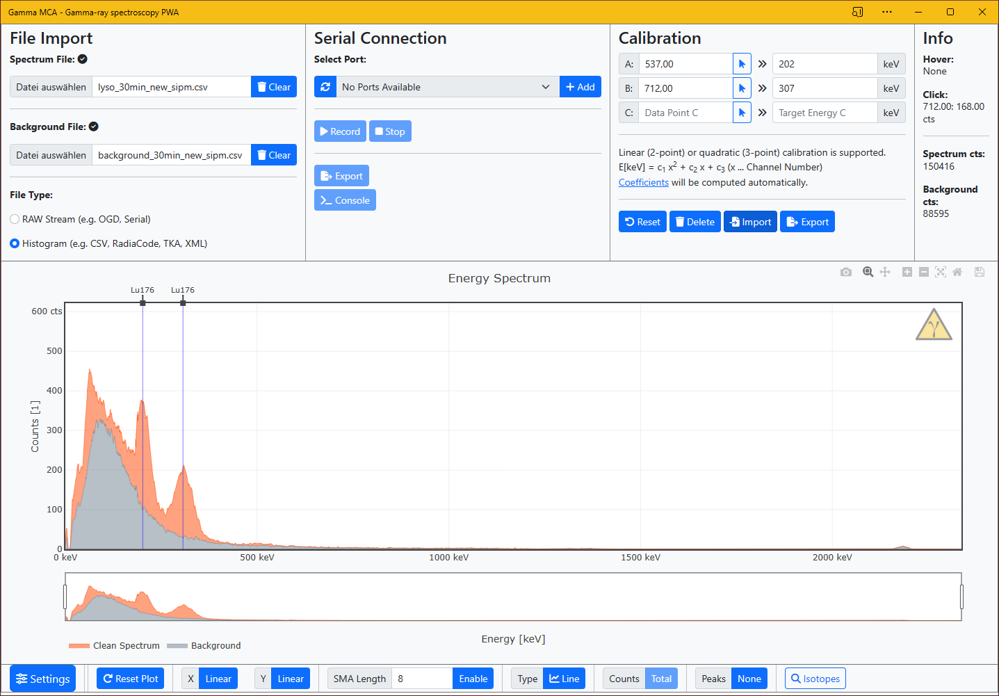

# Software

**If you just want to program you device with all the default settings, choose one of the `.uf2` files in this directory. This will be all you need if you just want to get going!**

If you want to play around with the firmware, the Arduino sketch can be found inside `ogd_pico`. It also includes some instructions on how to program. See below for more info about that.

**Note about HW compatability:** Each hardware revision of the detector has its own major version of the Arduino sketch indicated by the leading number of the version code. The versions are only tested on their respective hardware, so they might and probably will not work with newer or older detector boards. As an example, FW **4**.0.2 is designed to only run on Rev. **4** boards, while **3**.5.2 is only designed to run on Rev. **3** boards.

## Programming the Pi Pico

### Firmware Files

This is the easiest way to get started! You'll not have to download anything else besides the firmware UF2 file. This is the latest default firmware that you can use if you don't plan to modify any of the hardware aspects (such as the voltage reference, ADC resolution, etc) on the board itself. You can of course also use it with the Open Gamma Detector purchased from my Tindie store.

To get started with a fresh device, plug in the Raspberry Pi Pico via the micro-USB connection. A file manager window should now pop up. Drag and drop the `ogd_pico-XXX.uf2` file that you downloaded into this directory. The device will restart automatically once the transmission is completed and is ready to use!

If you want to update or re-flash the firmware, press and hold the `BOOTSEL` button on the Raspberry Pi Pico _while_ plugging it in the USB port of your computer. A file manager windows should once again pop up and you can let go of the button. Drag and drop the UF2 file just like above.

### Arduino IDE

To program the Pico you will need the following board configs in the latest release of the Arduino IDE:

- [Arduino-Pico](https://github.com/earlephilhower/arduino-pico)

The installation and additional documentation can be found in the respective GitHub repo, it's not complicated at all and you only need to do it once. You will also need the following additional libraries:

- [TaskScheduler](https://github.com/arkhipenko/TaskScheduler) [](https://www.ardu-badge.com/TaskScheduler)
- [SimpleShell Enhanced](https://github.com/NuclearPhoenixx/SimpleShell) [](https://www.ardu-badge.com/SimpleShell%20Enhanced)
- [ArduinoJson](https://github.com/bblanchon/ArduinoJson) [](https://www.ardu-badge.com/ArduinoJson)
- [Adafruit_SSD1306](https://github.com/adafruit/Adafruit_SSD1306) [](https://www.ardu-badge.com/Adafruit%20SSD1306)
- [Adafruit_SH110x](https://github.com/adafruit/Adafruit_SH110X) [](https://www.ardu-badge.com/Adafruit%20SH110X)
- [RunningMedian](https://github.com/RobTillaart/RunningMedian) [](https://www.ardu-badge.com/RunningMedian)

They can be installed by searching their names using the IDE's built-in library manager.

Please have a look at the `USER SETTINGS` in the Arduino sketch. You might need to change the default display parameters, such as I2C address, screen width and height depending on what display you are using.

Flash the Pico by choosing the `Raspberry Pi Pico` under `Tools/Board/Raspberry Pi RP2040 Boards` and then selecting `Flash Size: 2MB (Sketch: 1MB, FS: 1MB)`, leaving everything else at the default value. You can then press the big `Upload` button.

You can also try to **overclock** the device if you want. You cannot destroy anything as far as I know, so be experimental. The worst thing that can happen is the Pico locking up and you needing to reflash it by holding the `BOOTSEL` button. Mine ran stable at up to 225 with reduced core voltage and 250 MHz with the default voltage (almost double the stock clock!!!) and that had actually significantly improved the [detector dead time](https://hackaday.io/project/185211-all-in-one-gamma-ray-spectrometer/log/213190-pico-performance-improvements). Also flashing with `-Ofast` enabled also improved performance for me.

## Serial Interface

You can control your spectrometer using the serial interface. The following commands are available, type `help` to get a list of commands. Commands are case sensitive. Additional parameters needed for each command are surrounded by `< ... >`.

```text
> help
Usage:
	<command> [options]
Commands:
	read spectrum	: Read the spectrum histogram collected since the last reset.
	read settings	: Read the current settings (file).
	read info	: Read misc info about the firmware and state of the device.
	read fs		: Read misc info about the used filesystem.
	read dir	: Show contents of the data directory.
	read file	: <filename> Print the contents of the file <filename> from the data directory.
	remove file	: <filename> Remove the file <filename> from the data directory.
	set baseline	: <toggle> Automatically subtract the DC bias (baseline) from each signal.
	set trng	: <toggle> Either 'on' or 'off' to toggle the true random number generator output.
	set display	: <toggle> Either 'on' or 'off' to enable or force disable OLED support.
	set correction	: <toggle> Either 'on' or 'off' to toggle the CPS correction for the 4 faulty ADC channels.
	set mode	: <mode> Either 'geiger' or 'energy' to disable or enable energy measurements. Geiger mode only counts pulses, but is a lot faster.
	set out		: <mode> Either 'events', 'spectrum' or 'off'. 'events' prints events as they arrive, 'spectrum' prints the accumulated histogram.
	set averaging	: <number> Number of ADC averages for each energy measurement. Takes ints, minimum is 1.
	set tickrate	: <number> Rate at which the buzzer ticks, ticks once every <number> of pulses. Takes ints, minimum is 1.
	set ticker	: <toggle> Either 'on' or 'off' to enable or disable the onboard ticker.
	record start	: <time [min]> <filename> Start spectrum recording for duration <time> in minutes, (auto)save to <filename>.
	record stop	: Stop the recording.
	record status	: Get the recording status.
	reset spectrum	: Reset the on-board spectrum histogram.
	reset settings	: Reset all the settings/revert them back to default values.
	reboot		: Reboot the device.
```

All of these commands should be pretty straightforward with their respective description.

### Data Output

The output data format that can be controlled with the `set out <mode>` command can be switched between two modes:

- **Events:** This will print out all the ADC channels (bins) for newly acquired pulses in a chronological order. This data needs to be processed further to generate a pulse height histogram. Each pulse bin is delimited with a semicolon `;`.

Example (4096 channels):

```text
389;874;359;626;551;651;431;3123;466;214;662;1053;467;310;713;319;3001;294;340;493;437;1836;388;
570;354;318;330;688;1343;455;1627;359;252;652;449;602;
329;796;644;414;621;449;663;2311;0;538;224;394;421;444;362;885;406;437;796;994;579;319;456;404;442;922;441;973;
315;642;549;4095;588;774;361;329;1375;499;346;615;794;361;406;4095;457;1028;468;311;321;285;435;514;585;633;670;
```

- **Spectrum:** This is a histogram of all the ADC channels (bins) and the respective number of counts per channel. Each channel is delimited with a semicolon `;` and each spectrum is printed on its own line.

Example (4096 channels):

```text
12;0;0;0;0;0;0;0;0;0;0;0;0;0;0;0;0;0;0;0;0;0;0;0;0;0;0;0;0;0;0;0;0;0;0;0;0;0;0;0;0;0;0;0;0;0;0;0;0;0;0;0;0;0;0;0;0;0;0;0;0;0;0;0;0;0;0;0;0;0;0;0;0;0;0;0;0;0;0;0;0;0;0;0;0;0;0;0;0;0;0;0;0;0;0;0;0;0;0;0;0;0;0;0;0;0;0;0;0;0;0;0;0;0;0;0;0;0;0;0;0;0;0;0;0;0;0;0;0;0;0;0;0;0;0;0;0;0;0;0;0;0;0;0;0;0;0;0;0;0;0;0;1;1;1;0;0;0;0;0;0;0;0;0;0;0;0;0;0;0;0;0;0;0;0;0;0;0;0;0;0;0;0;0;0;0;0;0;0;0;1;1;0;0;0;0;0;0;0;0;0;0;0;0;3;0;3;0;4;1;1;0;2;1;1;0;0;1;1;1;1;2;1;0;2;0;0;1;2;1;0;0;0;2;1;1;1;0;1;1;0;1;1;0;0;1;0;1;0;1;0;3;3;1;0;2;0;0;1;2;1;0;0;0;1;2;1;1;0;0;1;0;0;3;0;1;2;0;0;0;0;0;2;0;0;3;2;1;0;0;2;2;0;1;2;1;1;3;3;0;0;1;2;0;0;2;1;2;2;1;2;5;2;0;3;2;1;3;3;3;0;3;2;3;1;3;0;5;4;6;3;0;2;3;1;1;1;4;0;4;3;2;2;3;1;4;3;5;3;5;4;4;4;1;8;3;1;4;2;4;1;4;4;2;2;6;3;2;1;2;1;5;3;2;2;3;3;4;3;2;4;3;3;4;5;1;3;3;5;4;1;5;3;1;4;5;3;2;4;1;6;2;3;2;2;4;4;1;2;1;2;7;3;2;4;0;3;1;2;2;5;2;1;2;3;4;2;6;2;1;2;2;2;3;1;5;5;5;1;3;2;3;5;3;2;4;1;3;2;2;2;0;2;3;0;3;2;3;4;2;4;4;0;2;0;3;3;3;3;2;0;1;1;2;4;4;3;1;2;0;2;2;3;4;1;4;1;1;1;3;2;1;5;4;0;1;0;2;0;3;1;2;5;0;0;0;4;5;3;1;2;0;2;6;3;2;2;2;4;0;0;1;2;3;5;4;2;3;0;2;2;2;3;1;0;0;0;1;2;1;0;1;2;3;1;3;2;2;0;4;0;4;7;0;1;0;3;1;1;1;1;2;1;0;1;2;1;2;1;1;2;0;3;3;0;2;3;0;1;2;2;0;2;0;0;3;2;1;2;0;0;0;0;2;4;1;0;2;1;1;1;1;3;3;1;2;3;4;0;3;4;0;1;1;1;1;0;0;1;2;1;3;0;1;3;0;2;0;0;0;0;0;0;1;2;2;1;2;0;1;0;1;1;3;3;1;1;1;0;2;2;1;1;1;0;0;1;0;0;2;2;1;1;1;1;2;0;2;0;2;1;2;0;1;1;0;0;0;0;0;0;1;1;0;1;0;2;2;2;0;0;2;2;2;1;0;3;2;1;0;1;1;2;1;2;1;1;1;1;0;2;0;1;2;0;0;1;0;0;0;1;0;3;0;0;1;0;1;1;2;1;0;0;0;2;0;0;1;1;1;0;2;0;0;1;0;0;3;0;1;0;1;0;2;0;0;3;1;1;1;0;2;1;0;1;0;0;0;1;0;1;2;0;0;1;0;0;0;1;0;0;0;0;0;0;0;0;0;0;1;1;1;0;3;1;0;2;0;2;0;0;1;0;2;1;0;0;0;0;0;1;2;0;0;0;0;2;0;2;1;1;1;1;0;0;0;1;2;0;0;0;0;1;0;2;0;0;0;0;0;0;0;0;0;1;0;0;0;1;2;3;0;0;0;0;0;0;0;0;1;0;1;0;0;0;0;0;0;0;0;1;0;0;0;1;0;1;1;0;1;0;0;0;0;0;1;0;0;0;0;0;0;0;1;2;0;0;0;1;1;0;0;1;1;0;0;0;0;0;0;1;1;0;0;1;0;1;0;0;0;0;0;1;0;0;1;0;0;0;0;0;0;0;0;0;0;0;0;1;0;0;0;0;0;0;0;0;2;1;0;0;0;0;0;0;1;0;0;0;0;0;0;0;0;0;0;0;1;0;0;0;0;1;1;0;0;0;0;0;0;0;0;0;0;0;0;0;0;0;0;0;0;1;0;1;1;1;0;1;0;0;0;0;0;0;0;1;0;0;1;0;0;0;0;0;0;0;0;0;0;0;0;1;0;0;0;1;0;1;0;0;0;0;0;0;0;0;0;0;0;0;0;0;0;0;0;1;0;0;0;0;0;0;1;0;1;0;1;1;0;0;0;0;0;0;0;0;1;2;1;0;1;0;0;0;0;0;0;0;1;0;0;0;1;0;0;0;0;1;0;1;0;0;0;0;0;0;0;0;0;0;3;0;0;0;1;0;0;1;0;0;1;0;0;0;0;0;1;1;0;0;1;0;0;0;0;0;0;0;0;0;0;0;0;0;0;0;0;0;0;1;1;0;0;0;0;0;0;0;0;0;1;0;0;0;0;0;0;0;0;0;0;1;0;0;0;0;0;0;0;0;0;0;0;0;0;0;0;0;0;0;0;0;0;0;1;0;0;0;0;0;0;0;0;0;0;0;2;0;0;0;0;0;0;0;1;0;0;1;0;0;0;0;0;0;0;0;0;0;0;1;0;0;0;0;0;0;0;0;0;0;0;0;0;0;0;0;0;0;0;0;0;0;0;0;0;0;0;0;1;0;0;0;0;0;0;0;0;0;0;1;0;0;0;0;0;0;0;0;0;0;0;1;0;0;0;0;0;0;1;0;0;0;0;0;1;0;1;0;0;0;0;0;0;0;0;0;0;0;0;0;0;0;0;0;1;0;0;0;0;1;0;0;0;0;0;0;0;0;0;0;0;0;1;1;0;0;1;0;1;0;0;0;0;0;0;0;0;0;0;0;0;0;1;0;0;0;0;0;0;0;0;0;0;0;0;0;0;0;0;0;0;0;0;0;0;0;0;1;0;0;0;0;0;0;1;0;0;0;0;0;0;0;0;0;0;1;0;0;0;0;0;0;0;1;0;0;0;0;0;0;0;0;0;0;0;0;1;0;0;0;0;0;0;0;0;0;0;0;0;0;0;0;0;0;0;0;0;0;0;0;0;0;0;0;0;0;0;0;1;0;0;1;0;0;0;0;1;0;0;0;0;0;0;0;0;0;0;0;1;0;0;0;0;0;1;0;0;0;0;0;0;0;0;0;0;0;0;0;0;0;0;0;1;0;0;0;0;0;0;0;0;1;0;0;0;0;0;0;0;0;0;0;0;0;0;0;0;0;0;0;0;0;0;0;2;1;0;0;0;1;0;0;0;0;0;0;0;0;0;0;0;1;0;0;0;1;0;0;0;0;0;0;0;0;0;0;0;0;0;0;0;0;0;0;0;0;0;0;0;0;0;0;0;1;0;0;0;0;0;0;0;0;0;0;0;0;0;0;0;0;0;0;0;0;1;0;0;0;1;0;0;0;1;0;0;0;0;0;0;0;0;0;0;0;0;1;0;0;0;0;0;0;0;0;0;0;0;0;0;0;0;0;0;0;0;0;1;0;0;0;0;0;0;0;0;0;0;0;0;0;0;0;0;1;0;0;0;0;0;0;0;0;0;0;0;0;0;0;0;0;0;0;0;0;0;0;0;0;0;0;0;0;0;0;0;0;0;0;0;0;0;0;0;0;0;0;0;0;0;0;0;0;1;0;0;0;0;0;0;0;0;0;1;0;0;0;0;0;0;0;0;0;0;0;0;0;0;0;0;0;0;0;0;0;0;0;0;0;0;0;0;0;0;0;0;0;0;0;0;0;0;0;0;0;0;0;0;0;0;0;0;1;1;0;1;0;0;1;0;0;0;0;0;0;0;0;0;0;0;0;0;0;0;0;0;0;0;0;1;0;0;0;0;0;0;0;0;0;0;0;0;0;0;0;0;0;0;0;0;0;0;0;0;0;0;0;0;0;0;0;0;0;0;0;1;0;0;0;0;1;0;0;0;0;0;0;0;0;0;0;0;0;0;0;0;1;0;0;0;0;0;0;0;0;0;0;0;0;0;0;0;0;0;0;0;0;0;0;0;0;0;0;0;2;0;0;0;0;0;0;0;0;0;0;0;0;0;0;0;0;0;0;0;0;0;0;0;0;0;0;0;0;0;0;0;0;0;0;0;0;0;1;0;0;0;0;0;0;1;0;0;0;0;0;0;0;0;0;0;0;0;0;1;0;0;0;0;0;0;0;1;0;0;1;0;0;0;0;0;0;0;0;0;0;0;0;0;0;0;0;0;0;0;0;0;0;0;0;0;0;1;0;0;0;0;0;0;0;0;0;0;0;0;0;0;0;0;0;0;0;0;0;0;0;0;0;0;0;0;0;0;0;0;0;0;0;0;0;0;0;0;0;1;0;0;0;0;0;0;0;0;0;0;0;0;0;0;0;0;0;0;0;0;0;0;0;0;0;0;0;0;0;0;0;0;0;0;0;0;0;0;0;0;0;0;0;0;0;0;0;0;0;0;0;0;0;0;0;0;0;0;0;0;0;0;0;0;0;0;0;0;0;0;0;0;0;0;0;0;0;0;0;0;0;0;0;0;0;0;0;0;0;0;1;0;0;0;0;0;0;0;0;0;0;0;0;0;0;0;0;0;0;0;0;1;0;0;0;0;0;0;0;0;0;0;0;0;0;0;0;0;0;0;0;0;0;0;0;0;0;0;0;0;0;0;0;0;0;0;0;0;0;1;0;0;0;0;0;0;0;0;0;0;0;0;0;0;0;0;0;1;0;0;0;1;0;0;0;0;0;0;0;0;0;0;0;0;0;0;0;0;0;0;0;0;0;1;0;0;0;0;0;0;0;0;0;0;0;0;0;0;0;0;0;0;1;0;0;0;0;0;0;0;0;0;1;0;0;0;0;0;0;0;0;0;0;0;0;0;0;0;0;0;0;0;0;0;1;0;1;0;0;0;0;0;0;0;0;0;0;0;0;0;0;0;0;0;0;0;0;0;0;0;0;0;0;0;0;0;0;0;0;0;0;0;0;0;0;0;0;0;0;0;0;0;0;0;0;0;0;0;0;0;0;0;0;0;0;0;0;1;0;0;0;0;0;0;0;0;0;0;0;0;0;0;0;0;0;0;0;0;0;0;0;0;0;0;0;0;0;0;0;0;0;0;0;0;0;0;0;0;1;0;0;0;0;0;0;0;0;0;0;0;0;0;0;0;0;0;0;0;0;0;0;0;0;0;0;0;0;0;0;0;0;0;0;0;0;0;0;1;0;0;0;0;0;0;0;0;0;0;0;0;0;0;0;0;0;0;0;0;0;0;0;0;0;0;0;0;0;0;0;0;0;0;0;0;0;0;0;0;0;0;0;0;0;0;0;0;1;0;0;0;0;0;0;0;0;0;0;0;0;0;0;0;0;1;0;0;0;0;0;0;0;0;0;0;0;0;0;0;0;0;0;0;0;0;0;0;0;0;1;0;0;0;0;0;0;1;0;0;0;0;0;0;0;0;0;0;0;0;0;0;0;0;0;0;0;0;0;0;0;0;0;0;0;0;0;0;0;0;0;1;0;0;0;0;0;0;0;0;0;0;0;0;0;0;0;0;0;0;0;0;0;0;0;0;0;0;0;0;0;0;0;0;0;0;0;0;0;0;0;0;0;0;0;0;0;0;0;0;0;0;0;0;0;0;0;0;0;0;0;0;0;0;0;0;0;0;0;0;0;0;0;0;0;0;0;0;0;0;0;0;0;1;0;0;0;0;0;0;0;0;0;0;0;0;0;0;0;0;0;0;0;0;0;0;0;0;0;0;0;0;0;0;0;0;0;0;0;0;0;0;0;0;0;0;0;0;0;0;0;0;0;0;0;0;0;0;0;0;0;0;0;0;0;0;0;0;0;0;0;0;0;0;0;0;0;0;0;0;0;0;0;0;1;0;0;0;0;0;0;0;0;0;0;0;1;0;0;0;0;0;0;0;0;0;0;0;0;0;0;0;0;0;0;0;0;0;0;0;0;0;0;0;0;0;0;0;0;0;0;0;1;0;0;0;0;0;0;0;0;0;0;0;0;0;0;0;0;0;0;0;0;0;0;0;0;0;0;0;0;0;0;0;0;0;0;0;0;0;0;0;0;0;0;0;0;0;0;0;0;0;0;0;0;0;0;0;0;0;0;0;0;0;0;0;0;0;0;0;0;0;0;0;0;0;0;0;0;0;0;0;0;0;0;0;0;0;0;0;0;0;0;0;0;0;0;0;0;0;0;0;0;0;0;0;0;0;0;0;0;0;0;0;0;0;0;0;0;0;0;0;0;0;0;0;0;0;0;0;0;0;0;0;0;0;0;0;0;0;0;0;0;0;0;0;0;0;0;0;0;0;0;0;0;0;0;0;0;0;1;0;0;0;0;0;0;0;0;0;0;0;0;0;0;1;0;0;0;0;0;0;0;0;0;0;0;0;0;0;0;0;0;0;0;0;0;0;0;0;0;0;0;0;0;0;0;0;0;0;0;0;0;1;0;0;0;0;0;0;0;0;0;0;0;0;0;0;0;0;0;0;0;0;0;0;0;0;0;0;0;0;0;1;0;0;0;0;0;0;0;0;0;0;0;0;0;0;0;0;0;0;0;0;0;0;0;0;0;1;0;0;0;0;0;0;0;0;0;0;1;0;0;0;0;0;0;0;0;0;0;0;0;0;0;0;0;0;0;0;0;0;0;0;0;0;0;0;0;0;0;0;0;0;0;0;0;0;0;0;0;0;0;0;0;0;0;0;0;0;0;0;0;0;0;0;0;0;0;0;0;0;0;0;0;0;0;0;0;0;0;0;0;0;0;0;0;0;0;0;0;0;0;0;0;0;0;0;0;0;0;0;0;0;0;0;0;0;0;0;0;0;0;0;0;0;0;0;0;0;0;2;0;0;0;0;0;0;0;0;0;0;0;0;0;0;0;0;0;0;0;0;0;0;0;0;0;0;0;0;0;0;0;0;0;0;0;0;0;0;0;0;0;0;0;0;0;0;0;0;0;0;0;0;0;0;0;0;0;0;0;0;0;0;0;0;0;0;0;0;0;0;0;0;0;0;0;0;0;0;0;0;0;0;0;0;0;0;0;0;0;0;0;0;0;0;0;0;0;0;0;0;0;0;0;0;0;0;0;0;0;1;0;0;0;0;0;0;0;0;0;0;0;0;0;0;0;0;0;0;0;0;0;0;0;0;0;0;0;0;0;0;0;0;0;0;0;0;0;0;0;0;0;0;0;0;0;0;0;0;0;0;0;0;0;0;0;0;0;0;0;0;0;0;0;0;0;0;0;0;0;0;0;0;0;0;0;0;0;0;0;0;0;0;0;0;0;0;0;0;0;0;0;0;0;0;0;0;0;0;0;0;0;0;0;0;0;0;0;0;0;0;0;0;0;0;0;0;0;0;0;0;0;0;0;0;0;0;0;0;0;0;0;0;0;0;0;0;0;0;0;0;0;0;0;0;0;0;0;0;0;0;0;0;0;0;0;0;0;0;0;0;0;0;0;0;0;0;0;0;0;0;0;0;0;0;0;0;0;0;0;0;0;0;0;0;0;0;0;0;0;0;0;0;0;0;0;0;0;0;0;0;0;0;0;0;0;0;0;0;0;0;0;0;0;0;0;0;0;0;0;0;0;0;0;0;0;0;0;0;0;0;0;0;0;0;0;0;0;0;0;0;0;0;0;0;0;0;0;0;0;0;0;0;0;0;0;0;0;0;0;0;0;0;0;0;0;0;0;0;0;0;0;0;0;0;0;0;0;0;0;0;0;0;0;0;0;0;0;0;0;0;0;0;0;0;0;0;0;0;0;0;0;0;0;0;0;0;0;0;0;0;0;0;0;0;0;0;0;0;0;0;0;0;0;0;0;0;0;0;0;0;0;0;0;0;0;0;0;0;0;0;0;0;0;0;0;0;0;0;0;0;0;0;0;0;0;0;0;0;0;0;0;0;0;0;0;0;0;0;0;0;0;0;0;0;0;0;0;0;0;0;0;0;0;0;0;0;0;0;0;0;0;0;0;0;0;0;0;0;0;0;0;0;0;0;0;0;0;0;0;0;0;0;0;0;0;0;0;0;0;0;0;0;0;0;0;0;0;0;0;0;0;0;0;0;0;0;0;0;0;0;0;0;0;0;0;0;0;0;0;0;0;0;0;0;0;0;0;0;0;0;0;0;0;0;0;0;0;0;0;0;0;0;0;0;0;0;0;0;0;0;0;0;0;0;0;0;0;0;0;0;0;0;0;0;0;0;0;0;0;0;0;0;0;0;0;0;0;0;0;0;0;0;0;0;0;0;0;0;0;0;0;0;0;0;0;0;0;0;0;0;0;0;0;0;0;0;0;0;0;0;0;0;0;0;0;0;0;0;0;0;0;0;0;0;0;0;0;0;0;0;0;0;0;0;0;0;0;0;0;0;0;0;0;0;0;0;0;0;0;0;0;0;0;0;0;0;0;0;0;0;0;0;0;0;0;0;0;0;0;0;0;0;0;0;0;0;0;0;0;0;0;0;0;0;0;0;0;0;0;0;0;0;0;0;0;0;0;0;0;0;0;0;0;0;0;0;0;0;0;0;0;0;0;0;0;0;0;0;0;0;0;0;0;0;0;0;0;0;0;0;0;0;0;0;0;0;0;0;0;0;0;0;0;0;0;0;0;0;0;0;0;0;0;0;0;0;0;0;0;0;0;0;0;0;0;0;0;0;0;0;0;0;0;0;0;0;0;0;0;0;0;0;0;0;0;0;0;0;0;0;0;0;0;0;0;0;0;0;0;0;0;0;0;0;0;0;0;0;0;0;0;0;0;0;0;0;0;0;0;0;0;0;0;0;0;0;0;0;1;0;0;0;0;0;0;0;0;0;0;0;0;0;0;0;0;0;0;0;0;0;0;0;0;0;0;0;0;0;0;0;0;0;0;0;0;0;0;0;0;0;0;0;0;0;0;0;0;0;0;0;0;0;0;0;0;0;0;0;0;0;0;0;0;0;0;0;0;0;0;0;0;0;0;0;0;0;0;0;0;0;0;0;0;0;0;0;0;0;0;0;0;0;0;0;0;0;0;0;0;0;0;4;
13;0;0;0;0;0;0;0;0;0;0;0;0;0;0;0;0;0;0;0;0;0;0;0;0;0;0;0;0;0;0;0;0;0;0;0;0;0;0;0;0;0;0;0;0;0;0;0;0;0;0;0;0;0;0;0;0;0;0;0;0;0;0;0;0;0;0;0;0;0;0;0;0;0;0;0;0;0;0;0;0;0;0;0;0;0;0;0;0;0;0;0;0;0;0;0;0;0;0;0;0;0;0;0;0;0;0;0;0;0;0;0;0;0;0;0;0;0;0;0;0;0;0;0;0;0;0;0;0;0;0;0;0;0;0;0;0;0;0;0;0;0;0;0;0;0;0;0;0;0;0;0;1;1;1;0;0;0;0;0;0;0;0;0;0;0;0;0;0;0;0;0;0;0;0;0;0;0;0;0;0;0;0;0;0;0;0;0;0;0;1;1;0;0;0;0;0;0;0;0;0;0;0;0;3;0;3;0;4;1;1;0;2;1;1;0;0;1;1;1;1;2;1;0;2;0;0;1;2;1;0;0;0;2;1;1;1;0;1;1;0;1;1;0;0;1;0;1;0;1;0;3;3;1;0;2;0;0;1;2;1;0;0;0;1;2;1;1;0;0;1;0;0;3;0;1;2;0;0;0;0;0;3;0;0;3;2;1;0;0;2;2;0;1;2;1;1;4;3;0;0;1;2;0;0;2;1;2;3;1;2;5;2;0;3;2;1;3;3;3;0;3;2;3;1;3;0;5;4;6;3;0;2;3;1;1;1;4;0;4;3;2;2;3;1;4;3;5;3;5;4;4;4;1;8;3;1;4;2;4;1;4;4;2;2;7;3;2;1;2;1;5;3;2;2;3;3;4;3;2;4;3;3;4;5;1;3;3;5;4;1;5;3;1;4;5;3;2;4;1;6;2;3;2;3;4;4;1;2;1;2;8;3;2;4;0;3;1;2;2;5;2;1;2;3;4;2;6;2;1;2;2;2;3;1;5;5;5;1;3;3;3;5;3;2;4;1;3;2;2;2;0;2;3;0;3;2;3;4;2;4;4;0;2;0;3;3;3;3;2;1;1;1;2;4;4;3;1;2;0;2;2;3;4;1;4;1;1;1;3;2;1;5;4;0;1;0;2;0;3;1;2;5;0;0;0;4;5;3;3;2;0;2;6;3;2;2;2;4;0;0;1;2;3;5;4;2;3;0;2;2;2;3;1;0;0;0;1;2;1;0;1;2;3;1;3;2;2;0;4;0;4;8;0;1;0;3;1;1;1;1;2;1;0;1;2;2;2;1;1;2;0;3;3;0;2;3;0;2;2;2;0;2;0;0;3;2;1;2;0;0;0;0;2;4;1;0;2;1;1;1;1;3;3;1;2;3;4;0;3;4;0;1;1;1;1;0;0;1;2;1;3;0;1;3;0;2;0;0;0;0;0;0;1;2;2;1;2;0;1;0;1;1;3;3;1;1;1;0;2;2;1;1;1;0;0;1;0;0;2;2;1;1;1;1;2;0;2;0;2;1;2;0;1;1;0;0;0;0;0;0;1;1;0;1;0;2;2;2;0;0;2;2;2;1;0;3;2;1;0;1;1;2;1;2;1;1;1;1;0;2;0;1;2;0;0;1;0;0;0;1;0;3;0;0;1;0;1;1;2;1;0;0;0;2;0;0;1;1;1;0;2;0;0;1;0;0;3;0;1;0;1;0;2;0;0;3;1;1;1;0;2;1;0;1;0;0;0;1;0;1;2;0;0;1;0;0;0;1;0;0;0;0;0;0;0;0;0;0;1;1;1;0;3;1;0;2;0;2;0;0;1;0;2;1;0;0;0;0;0;1;2;0;0;0;0;3;0;2;1;1;1;1;0;0;0;1;2;0;0;0;0;1;0;2;0;0;0;0;0;0;0;0;0;1;0;0;0;1;2;3;0;0;0;0;0;0;0;0;1;0;1;0;0;0;0;0;0;0;0;1;0;0;0;1;0;1;1;0;1;0;0;0;0;0;1;0;0;0;0;0;0;0;1;2;0;0;0;1;1;0;0;1;1;0;0;0;0;0;0;1;1;0;0;1;0;1;0;0;0;0;0;1;0;0;1;0;0;0;0;0;0;0;0;0;0;0;0;1;0;0;0;0;0;0;0;0;2;1;0;0;0;0;0;0;1;0;0;0;0;0;0;0;0;0;0;0;1;0;0;0;0;1;1;0;0;0;0;0;0;0;0;0;0;1;0;0;0;0;0;0;0;1;0;1;1;1;0;1;0;0;0;0;0;0;0;1;0;0;1;0;0;0;0;0;0;0;0;0;0;0;0;1;0;0;0;1;0;1;0;0;0;0;0;0;0;0;0;0;0;0;0;0;0;0;0;1;0;0;0;0;0;0;1;0;1;0;1;1;0;0;0;0;0;0;0;0;1;2;1;0;1;0;0;0;0;0;0;0;1;0;0;0;1;0;0;0;0;1;0;1;0;0;0;0;0;0;0;0;0;0;3;0;0;0;1;0;0;1;0;0;1;0;0;0;0;0;1;1;0;0;1;0;0;0;0;0;0;0;0;0;0;0;0;0;0;0;0;0;0;1;1;0;0;0;0;0;0;0;0;0;1;0;0;0;0;0;0;0;0;0;0;1;0;0;0;0;0;0;0;0;0;0;0;0;0;0;0;0;0;0;0;0;0;0;1;0;0;0;0;0;1;0;0;0;0;0;2;0;0;0;0;0;0;0;1;0;0;1;0;0;0;0;0;0;0;0;0;0;0;1;0;0;0;0;0;0;0;0;0;0;0;0;0;0;0;0;0;0;0;0;0;0;0;0;0;0;0;0;1;0;0;0;0;0;0;0;0;0;0;1;0;0;0;0;0;0;0;0;0;0;0;1;0;0;0;0;0;0;1;0;0;0;0;0;1;0;1;0;0;0;0;0;0;0;0;0;0;0;0;0;0;0;0;0;1;0;0;0;0;1;0;0;0;0;0;0;0;0;0;0;0;0;1;1;0;0;1;0;1;0;0;0;0;0;0;0;0;0;0;0;0;0;1;0;0;0;0;0;0;0;0;0;0;0;0;0;0;0;0;0;0;0;0;0;0;0;0;1;0;0;0;0;0;0;1;0;0;0;0;0;0;0;0;0;0;1;0;0;0;0;0;0;0;1;0;0;0;0;0;0;0;0;0;0;0;0;1;0;0;0;0;0;0;0;0;0;0;0;0;0;0;0;0;0;0;0;0;0;0;0;0;0;0;0;0;0;0;0;1;0;0;1;0;0;0;0;1;0;0;0;0;0;0;0;0;0;0;0;1;0;0;0;0;0;1;1;0;0;0;0;0;0;0;0;0;0;0;0;0;0;0;0;1;0;0;0;0;0;0;0;0;1;0;0;0;0;0;0;0;0;0;0;0;0;0;0;0;0;0;0;0;0;0;0;2;1;0;0;0;1;0;0;0;0;0;0;0;0;0;0;0;1;0;0;0;1;0;0;0;0;0;0;0;0;0;0;0;0;0;0;0;0;0;0;0;0;0;0;0;0;0;0;0;1;0;0;0;0;0;0;0;0;0;0;0;0;0;0;0;0;0;0;0;0;1;0;0;0;1;0;0;0;1;0;0;0;0;0;0;0;0;0;0;0;0;1;0;0;0;0;0;0;0;0;0;0;0;0;0;0;0;0;0;0;0;0;1;0;0;0;0;0;0;0;0;0;0;0;0;0;0;0;0;1;0;0;0;0;0;0;0;0;0;0;0;0;0;0;0;0;0;0;0;0;0;0;0;0;0;0;0;0;0;0;0;0;0;0;0;0;0;0;0;0;0;0;0;0;0;0;0;0;1;0;0;0;0;0;0;0;0;0;1;0;0;0;0;0;0;0;0;0;0;0;0;0;0;0;0;0;0;0;0;0;0;0;0;0;0;0;0;0;0;0;0;0;0;0;0;0;0;0;0;0;0;0;0;0;0;0;0;1;1;0;1;0;0;1;0;0;0;0;0;0;0;0;0;0;0;0;0;0;0;0;0;0;0;0;1;0;0;0;0;0;0;0;0;0;0;0;0;0;0;0;0;0;0;0;0;0;0;0;0;0;0;0;0;0;0;0;0;0;0;0;1;0;0;0;0;1;0;0;0;0;0;0;0;0;0;0;0;0;0;0;0;1;0;0;0;0;0;0;0;0;0;0;0;0;0;0;0;0;0;0;0;0;0;0;0;0;0;0;0;2;0;0;0;0;0;0;0;0;0;0;0;0;0;0;0;0;0;0;0;0;0;0;0;0;0;0;0;0;0;0;0;0;0;0;0;0;0;1;0;0;0;0;0;0;1;0;0;0;0;0;0;0;0;0;0;0;0;0;1;0;0;0;0;0;0;0;1;0;0;1;0;0;0;0;0;0;0;0;0;0;0;0;0;0;0;0;0;0;0;0;0;0;0;0;0;0;1;0;0;0;0;0;0;0;0;0;0;0;0;0;0;0;0;0;0;0;0;0;0;0;0;0;0;0;0;0;0;0;0;0;0;0;0;0;0;0;0;0;1;0;0;0;0;0;0;0;0;0;0;0;0;0;0;0;0;0;0;0;0;0;0;0;0;0;0;0;0;0;0;0;0;0;0;0;0;0;0;0;0;0;0;0;0;0;0;0;0;0;0;0;0;0;0;0;0;0;0;0;0;0;0;0;0;0;0;0;0;0;0;0;0;0;0;0;0;0;0;0;0;0;0;0;0;0;0;0;0;0;0;1;0;0;0;0;0;0;0;0;0;0;0;0;0;0;0;0;0;0;0;0;1;0;0;0;0;0;0;0;0;0;0;0;0;0;0;0;0;0;0;0;0;0;0;0;0;0;0;0;0;0;0;0;0;0;0;0;0;0;1;0;0;0;0;0;0;0;0;0;0;0;0;0;0;0;0;0;1;0;0;0;1;0;0;0;0;0;0;0;0;0;0;0;0;0;0;0;0;0;0;0;0;0;1;0;0;0;0;0;0;0;0;0;0;0;0;0;0;0;0;0;0;1;0;0;0;0;0;0;0;0;0;1;0;0;0;0;0;0;0;0;0;0;0;0;0;0;0;0;0;0;0;0;0;1;0;1;0;0;0;0;0;0;0;0;0;0;0;0;0;0;0;0;0;0;0;0;0;0;0;0;0;0;0;0;0;0;0;0;0;0;0;0;0;0;0;0;0;0;0;0;0;0;0;0;0;0;0;0;0;0;0;0;0;0;0;0;1;0;0;0;0;0;0;0;0;0;0;0;0;0;0;0;0;0;0;0;0;0;0;0;0;0;0;0;0;0;0;1;0;0;0;0;0;0;0;0;0;1;0;0;0;0;0;0;0;0;0;0;0;0;0;0;0;0;0;0;0;0;0;0;0;0;0;0;0;0;0;0;0;0;0;0;0;0;0;0;1;0;0;0;0;0;0;0;0;0;0;0;0;0;0;0;0;0;0;0;0;0;0;0;0;0;0;0;0;0;0;0;0;0;0;0;0;0;0;0;0;0;0;0;0;0;0;0;0;1;0;0;0;0;0;0;0;0;0;0;0;0;0;0;0;0;1;0;0;0;0;0;0;0;0;0;0;0;0;0;0;0;0;0;0;0;0;0;0;0;0;1;0;0;0;0;0;0;1;0;0;0;0;0;0;0;0;0;0;0;0;0;0;0;0;0;0;0;0;0;0;0;0;0;0;0;0;0;0;1;0;0;1;0;0;0;0;0;0;0;0;0;0;0;0;0;0;0;0;0;0;0;0;0;0;0;0;0;0;0;0;0;0;0;0;0;0;0;0;0;0;0;0;0;0;0;0;0;0;0;0;0;0;0;0;0;0;0;0;0;0;0;0;0;0;0;0;0;0;0;0;0;0;0;0;0;0;0;0;0;0;0;0;0;1;0;0;0;0;0;0;0;0;0;0;0;0;0;0;0;0;0;0;0;0;0;0;0;0;0;0;0;0;0;0;0;0;0;0;0;0;0;0;0;0;0;0;0;0;0;0;0;0;0;0;0;0;0;0;0;0;0;0;0;0;0;0;0;0;0;0;0;0;0;0;0;0;0;0;0;0;0;0;0;0;1;0;0;0;0;0;0;0;0;0;0;0;1;0;0;0;0;0;0;0;0;0;0;0;0;0;0;0;0;0;0;0;0;0;0;0;0;0;0;0;0;0;0;0;0;0;0;0;1;0;0;0;0;0;0;0;0;0;0;0;0;0;0;0;0;0;0;0;0;0;0;0;0;0;0;0;0;0;0;0;0;0;0;0;0;0;0;0;0;0;0;0;0;0;0;0;0;0;0;0;0;0;0;0;0;0;0;0;0;0;0;0;0;0;0;0;0;0;0;0;0;0;0;0;0;0;0;0;0;0;0;0;0;0;0;0;0;0;0;0;0;0;0;0;0;0;0;0;0;0;0;0;0;0;0;0;0;0;0;0;0;0;0;0;0;0;0;0;0;0;0;0;0;0;0;0;0;0;0;0;0;0;0;0;0;0;0;0;0;0;0;0;0;0;0;0;0;0;0;0;0;0;0;0;0;0;1;0;0;0;0;0;0;0;0;0;0;0;0;0;0;1;0;0;0;0;0;0;0;0;0;0;0;0;0;0;0;0;0;0;0;0;0;0;0;0;0;0;0;0;0;0;0;0;0;0;0;0;0;1;0;0;0;0;0;0;0;0;0;0;0;0;0;0;0;0;0;0;0;0;0;0;0;0;0;0;0;0;0;1;0;0;0;0;0;0;0;0;0;0;0;0;0;0;0;0;0;0;0;0;0;0;0;0;0;1;0;0;0;0;0;0;0;0;0;0;1;0;0;0;0;0;0;0;0;0;0;0;0;0;0;0;0;0;0;0;0;0;0;0;0;0;0;0;0;0;0;0;0;0;0;0;0;0;0;0;0;0;0;0;0;0;0;0;0;0;0;0;0;0;0;0;0;0;0;0;0;0;0;0;0;0;0;0;0;0;0;0;0;0;0;0;0;0;0;0;0;0;0;0;0;0;0;0;0;0;0;0;0;0;0;0;0;0;0;0;0;0;0;0;0;0;0;0;0;0;0;2;0;0;0;0;0;0;0;0;0;0;0;0;0;0;0;0;0;0;0;0;0;0;0;0;0;0;0;0;0;0;0;0;0;0;0;0;0;0;0;0;0;0;0;0;0;0;0;0;0;0;0;0;0;0;0;0;0;0;0;0;0;0;0;0;0;0;0;0;0;0;0;0;0;0;0;0;0;0;0;0;0;0;0;0;0;0;0;0;0;0;0;0;0;0;0;0;0;0;0;0;0;0;0;0;0;0;0;0;0;1;0;0;0;0;0;0;0;0;0;0;0;0;0;0;0;0;0;0;0;0;0;0;0;0;0;0;0;0;0;0;0;0;0;0;0;0;0;0;0;0;0;0;0;0;0;0;0;0;0;0;0;0;0;0;0;0;0;0;0;0;0;0;0;0;0;0;0;0;0;0;0;0;0;0;0;0;0;0;0;0;0;0;0;0;0;0;0;0;0;0;0;0;0;0;0;0;0;0;0;0;0;0;0;0;0;0;0;0;0;0;0;0;0;0;0;0;0;0;0;0;0;0;0;0;0;0;0;0;0;0;0;0;0;0;0;0;0;0;0;0;0;0;0;0;0;0;0;0;0;0;0;0;0;0;0;0;0;0;0;0;0;0;0;0;0;0;0;0;0;0;0;0;0;0;0;0;0;0;0;0;0;0;0;0;0;0;0;0;0;0;0;0;0;0;0;0;0;0;0;0;0;0;0;0;0;0;0;0;0;0;0;0;0;0;0;0;0;0;0;0;0;0;0;0;0;0;0;0;0;0;0;0;0;0;0;0;0;0;0;0;0;0;0;0;0;0;0;0;0;0;0;0;0;0;0;0;0;0;0;0;0;0;0;0;0;0;0;0;0;0;0;0;0;0;0;0;0;0;0;0;0;0;0;0;0;0;0;0;0;0;0;0;0;0;0;0;0;0;0;0;0;0;0;0;0;0;0;0;0;0;0;0;0;0;0;0;0;0;0;0;0;0;0;0;0;0;0;0;0;0;0;0;0;0;0;0;0;0;0;0;0;0;0;0;0;0;0;0;0;0;0;0;0;0;0;0;0;0;0;0;0;0;0;0;0;0;0;0;0;0;0;0;0;0;0;0;0;0;0;0;0;0;0;0;0;0;0;0;0;0;0;0;0;0;0;0;0;0;0;0;0;0;0;0;0;0;0;0;0;0;0;0;0;0;0;0;0;0;0;0;0;0;0;0;0;0;0;0;0;0;0;0;0;0;0;0;0;0;0;0;0;0;0;0;0;0;0;0;0;0;0;0;0;0;0;0;0;0;0;0;0;0;0;0;0;0;0;0;0;0;0;0;0;0;0;0;0;0;0;0;0;0;0;0;0;0;0;0;0;0;0;0;0;0;0;0;0;0;0;0;0;0;0;0;0;0;0;0;0;0;0;0;0;0;0;0;0;0;0;0;0;0;0;0;0;0;0;0;0;0;0;0;0;0;0;0;0;0;0;0;0;0;0;0;0;0;0;0;0;0;0;0;0;0;0;0;0;0;0;0;0;0;0;0;0;0;0;0;0;0;0;0;0;0;0;0;0;0;0;0;0;0;0;0;0;0;0;0;0;0;0;0;0;0;0;0;0;0;0;0;0;0;0;0;0;0;0;0;0;0;0;0;0;0;0;0;0;0;0;0;0;0;0;0;0;0;0;0;0;0;0;0;0;0;0;0;0;0;0;0;0;0;0;0;0;0;0;0;0;0;0;0;0;0;0;0;0;0;0;0;0;0;0;0;0;0;0;0;0;0;0;0;0;0;0;0;0;0;0;0;0;0;0;0;0;0;0;0;0;0;0;0;0;0;0;0;0;0;0;0;0;0;0;0;0;0;0;0;0;0;0;0;0;0;0;0;0;0;0;0;0;0;0;0;0;0;0;0;0;0;0;0;0;0;0;0;0;0;0;0;0;0;0;0;0;0;0;0;0;0;0;0;0;0;0;0;0;0;1;0;0;0;0;0;0;0;0;0;0;0;0;0;0;0;0;0;0;0;0;0;0;0;0;0;0;0;0;0;0;0;0;0;0;0;0;0;0;0;0;0;0;0;0;0;0;0;0;0;0;0;0;0;0;0;0;0;0;0;0;0;0;0;0;0;0;0;0;0;0;0;0;0;0;0;0;0;0;0;0;0;0;0;0;0;0;0;0;0;0;0;0;0;0;0;0;0;0;0;0;0;0;4;
13;0;0;0;0;0;0;0;0;0;0;0;0;0;0;0;0;0;0;0;0;0;0;0;0;0;0;0;0;0;0;0;0;0;0;0;0;0;0;0;0;0;0;0;0;0;0;0;0;0;0;0;0;0;0;0;0;0;0;0;0;0;0;0;0;0;0;0;0;0;0;0;0;0;0;0;0;0;0;0;0;0;0;0;0;0;0;0;0;0;0;0;0;0;0;0;0;0;0;0;0;0;0;0;0;0;0;0;0;0;0;0;0;0;0;0;0;0;0;0;0;0;0;0;0;0;0;0;0;0;0;0;0;0;0;0;0;0;0;0;0;0;0;0;0;0;0;0;0;0;0;0;1;1;1;0;0;0;0;1;0;0;0;0;0;0;0;0;0;0;0;0;0;0;0;0;0;0;0;0;0;0;0;0;0;0;0;0;0;0;1;1;0;0;0;0;0;0;0;0;0;0;0;0;3;1;3;0;4;1;1;0;2;1;1;0;0;1;1;1;1;2;1;0;2;0;0;1;2;1;0;0;0;2;1;1;1;1;1;1;0;1;2;0;0;1;0;1;0;1;0;3;3;1;0;2;0;0;2;2;1;0;0;0;1;2;1;1;0;0;1;0;0;3;0;1;2;0;0;0;0;0;3;0;0;3;2;1;0;0;2;2;1;1;2;1;1;4;3;1;1;1;3;0;1;2;1;2;3;1;2;5;2;0;3;2;1;4;3;3;0;3;2;3;1;3;0;5;4;6;4;0;2;3;1;1;1;4;0;4;3;2;2;3;1;4;3;5;3;5;5;4;4;1;8;3;1;4;2;4;2;5;4;2;2;7;3;2;1;2;2;5;3;2;2;3;3;4;3;2;4;3;3;4;5;1;3;3;5;4;1;5;3;1;4;5;3;2;4;1;6;3;3;2;3;4;4;1;2;1;2;8;3;2;4;0;4;1;2;2;5;2;1;2;3;4;2;7;2;2;2;2;2;3;1;5;5;5;1;3;3;4;5;3;2;4;1;3;2;2;2;0;2;3;0;3;2;4;4;2;4;4;0;2;0;3;3;3;3;3;1;1;1;2;4;4;3;1;3;0;2;2;3;4;1;4;1;1;1;3;2;1;5;4;0;1;0;2;0;3;1;2;5;0;0;0;4;5;3;3;2;0;2;6;3;2;2;2;4;0;0;1;2;3;5;4;2;3;0;2;2;3;3;1;0;0;0;1;2;1;0;1;2;3;1;3;2;3;0;4;0;4;8;0;1;0;3;1;1;1;1;2;1;0;1;2;2;2;1;1;2;0;3;3;0;3;3;0;2;2;2;0;2;0;0;3;2;2;2;0;0;0;0;2;4;1;0;2;1;2;1;1;3;3;1;2;3;4;0;3;4;0;1;1;1;1;0;0;1;2;1;3;0;1;3;0;2;0;0;0;0;0;0;1;2;2;1;2;0;1;0;1;1;3;3;1;1;1;0;3;2;1;1;1;0;0;1;0;0;2;2;2;1;1;1;2;0;2;0;2;1;2;0;1;1;0;0;0;0;0;0;1;1;0;1;0;2;2;2;0;0;2;3;2;1;0;3;2;1;0;1;1;2;1;2;1;1;1;1;0;2;0;1;2;1;0;1;0;0;0;1;0;3;0;0;1;0;1;1;2;1;0;0;0;2;0;0;1;1;1;0;2;0;0;1;0;0;3;0;1;0;1;0;2;0;0;3;1;1;1;0;2;1;0;1;0;0;0;1;0;1;2;0;0;1;0;0;0;1;0;0;0;0;0;0;0;0;0;0;1;1;1;0;3;1;0;2;0;2;0;0;1;0;2;1;0;0;0;0;0;1;2;0;0;0;0;3;0;2;1;1;1;1;0;0;0;1;2;0;0;0;0;1;0;2;0;0;0;0;0;0;0;0;0;1;0;0;0;1;2;3;0;0;0;0;0;0;0;0;1;0;1;0;0;0;0;0;0;0;0;1;0;0;0;1;0;1;1;0;1;0;0;0;0;0;1;0;0;0;0;0;0;0;1;2;0;0;0;1;1;0;0;1;1;0;0;0;0;0;0;1;1;0;0;1;0;1;0;0;0;0;0;1;0;0;1;0;0;0;0;0;0;0;0;0;0;0;0;1;0;0;0;0;0;0;0;0;2;1;0;0;0;0;0;0;1;0;0;0;0;0;0;0;0;0;0;0;1;0;0;0;0;1;1;0;0;0;0;0;0;0;0;0;0;1;0;0;0;0;0;0;0;1;0;1;1;1;0;1;0;0;0;0;0;1;0;1;0;0;1;0;0;0;0;0;0;0;0;0;0;0;0;1;0;0;0;1;0;1;0;0;0;0;0;0;0;0;0;0;0;0;0;0;0;0;0;1;0;0;0;0;0;0;1;0;1;0;1;1;0;0;0;0;0;0;0;0;1;2;1;0;1;0;0;0;0;0;0;0;1;0;0;0;1;0;0;0;0;1;0;1;0;0;0;0;0;0;0;0;0;0;3;0;0;0;1;0;0;1;0;0;1;0;0;0;0;0;1;1;0;0;1;0;0;0;0;0;0;0;0;0;0;0;0;0;0;0;0;0;0;1;1;0;0;0;0;0;0;0;0;0;1;0;0;0;0;0;0;0;0;0;0;1;0;0;0;0;0;0;0;0;0;0;0;0;0;0;0;0;0;0;0;0;0;0;1;0;0;0;0;0;1;0;0;0;0;0;2;0;0;0;0;0;0;0;1;0;0;1;0;0;0;0;0;0;0;0;0;0;0;1;0;0;0;0;0;0;0;0;0;0;0;0;0;0;0;0;0;0;0;0;0;0;0;0;0;0;0;0;1;0;0;0;0;0;0;0;0;0;0;1;0;0;0;0;0;0;0;0;0;0;0;1;0;0;0;0;0;0;1;0;0;0;0;0;1;0;1;0;0;0;0;0;0;0;0;0;0;0;0;0;0;0;0;0;1;0;0;0;0;1;0;0;0;0;0;0;0;0;0;0;0;0;1;1;0;0;1;0;1;0;0;0;0;0;0;0;0;0;0;0;0;0;1;0;0;0;0;0;0;0;0;0;0;0;0;0;0;0;0;0;0;0;0;0;0;0;0;1;0;0;0;0;0;0;1;0;0;0;0;0;0;0;0;0;0;1;0;0;0;0;0;0;0;1;0;0;0;0;0;0;0;0;0;0;0;0;1;0;0;0;0;0;0;0;0;0;0;0;0;0;0;0;0;0;0;0;0;0;0;0;0;0;0;0;0;0;0;0;1;0;0;1;0;0;0;0;1;0;0;0;0;0;0;0;0;0;0;0;1;0;0;0;0;0;1;1;0;0;0;0;0;0;0;0;0;0;0;0;0;0;0;0;1;0;0;0;0;0;0;0;0;1;0;0;0;0;0;0;0;0;0;0;0;0;0;0;0;0;0;0;0;0;0;0;2;1;0;0;0;1;0;0;0;0;0;0;0;0;0;0;0;1;0;0;0;1;0;0;0;0;0;0;0;0;0;0;0;0;0;0;0;0;0;0;0;0;0;0;0;0;0;0;0;1;0;0;0;0;0;0;0;0;0;0;0;0;0;0;0;0;0;0;0;0;1;0;0;0;1;0;0;0;1;0;0;0;0;0;0;0;0;0;0;0;0;1;0;0;0;0;0;0;0;0;0;0;0;0;0;0;0;0;0;0;0;0;1;0;0;0;0;0;0;0;0;0;0;0;0;0;0;0;0;1;0;0;0;0;0;0;0;0;0;0;0;0;0;0;0;0;0;0;0;0;0;0;0;0;0;0;0;0;0;0;0;0;0;0;0;0;0;0;0;0;0;0;0;0;0;0;0;0;1;0;0;0;0;0;0;0;0;0;1;0;0;0;0;0;0;0;0;0;0;0;0;0;0;0;0;0;0;0;0;0;0;0;0;0;0;0;0;0;0;0;0;0;0;0;0;0;0;0;0;0;0;0;0;0;0;0;0;1;1;0;1;0;0;1;0;0;0;0;0;0;0;0;0;0;0;0;0;0;0;0;0;0;0;0;1;0;0;0;0;0;0;0;0;0;0;0;0;0;0;0;0;0;0;0;0;0;0;0;0;0;0;0;0;0;0;0;0;0;0;0;1;0;0;0;0;1;0;0;0;0;0;0;0;0;0;0;0;0;0;0;0;1;0;0;0;0;0;0;0;0;0;0;0;0;0;0;0;0;0;0;0;0;0;0;0;0;0;0;0;2;0;0;0;0;0;0;0;0;0;0;0;0;0;0;0;0;0;0;0;0;0;0;0;0;0;0;0;0;0;0;0;0;0;0;0;0;0;1;0;0;0;0;0;0;1;0;0;0;0;0;0;0;0;0;0;0;0;0;1;0;0;0;0;0;0;0;1;0;0;1;0;0;0;0;0;0;0;0;0;0;0;0;0;0;0;0;0;0;0;0;0;0;0;0;0;0;1;0;0;0;0;0;0;0;0;0;0;0;0;0;0;0;0;0;0;0;0;0;0;0;0;0;0;0;0;0;0;0;0;0;0;0;0;0;0;0;0;0;1;0;0;0;0;0;0;0;0;0;0;0;0;0;0;0;0;0;0;0;0;0;0;0;0;0;0;0;0;0;0;0;0;0;0;0;0;0;0;0;0;0;0;0;0;0;0;0;0;0;0;0;0;0;0;0;0;0;0;0;0;0;0;0;0;0;0;0;0;0;0;0;0;0;0;0;0;0;0;0;0;0;0;0;0;0;0;0;0;0;0;1;0;0;0;0;0;0;0;0;0;0;0;0;0;0;0;0;0;0;0;0;1;0;0;0;0;0;0;0;0;0;0;0;0;0;0;0;0;0;0;0;0;0;0;0;0;0;0;0;0;0;0;0;0;0;0;0;0;0;1;0;0;0;0;0;0;0;0;0;0;0;0;0;0;0;0;0;1;0;0;0;1;0;0;0;0;0;0;0;0;0;0;0;0;0;0;0;0;0;0;0;0;0;1;0;0;0;0;0;0;0;0;0;0;0;0;0;0;0;0;0;0;1;0;0;0;0;0;0;0;0;0;1;0;0;0;0;0;0;0;0;0;0;0;0;0;0;0;0;0;0;0;0;0;1;0;1;0;0;0;0;0;0;0;0;0;0;0;0;0;0;0;0;0;0;0;0;0;0;0;0;0;0;0;0;0;0;0;0;0;0;0;0;0;0;0;0;0;0;0;0;0;0;0;0;0;0;0;0;0;0;0;0;0;0;0;0;1;0;0;0;0;0;0;0;0;0;0;0;0;0;0;0;0;0;0;0;0;0;0;0;0;0;0;0;0;0;0;1;0;0;0;0;0;0;0;0;0;1;0;0;0;0;0;0;0;0;0;0;0;0;0;0;0;0;0;0;0;0;0;0;0;0;0;0;0;0;0;0;0;0;0;0;0;0;0;0;1;0;0;0;0;0;0;0;0;0;0;0;0;0;0;0;0;0;0;0;0;0;0;0;0;0;0;0;0;0;0;0;0;0;0;0;0;0;0;0;0;0;0;0;0;0;0;0;0;1;0;0;0;0;0;0;0;0;0;0;0;0;0;0;0;0;1;0;0;0;0;0;0;0;0;0;0;0;0;0;0;0;0;0;0;0;0;0;0;0;0;1;0;0;0;0;0;0;1;0;0;0;0;0;0;0;0;0;0;0;0;0;0;0;0;0;0;0;0;0;0;0;0;0;0;0;0;0;0;1;0;0;1;0;0;0;0;0;0;0;0;0;0;0;0;0;0;0;0;0;0;0;0;0;0;0;0;0;0;0;0;0;0;0;0;0;0;0;0;0;0;0;0;0;0;0;0;0;0;0;0;0;0;0;0;0;0;0;0;0;0;0;0;0;0;0;0;0;0;0;0;0;0;0;0;0;0;0;0;0;0;0;0;0;1;0;0;0;0;0;0;0;0;0;0;0;0;0;0;0;0;0;0;0;0;0;0;0;0;0;0;0;0;0;0;0;0;0;0;0;0;0;0;0;0;0;0;0;0;0;0;0;0;0;0;0;0;0;0;0;0;0;0;0;0;0;0;0;0;0;0;0;0;0;0;0;0;0;0;0;0;0;0;0;0;1;0;0;0;0;0;0;0;0;0;0;0;1;0;0;0;0;0;0;0;0;0;0;0;0;0;0;0;0;0;0;0;0;0;0;0;0;0;0;0;0;0;0;0;0;0;0;0;1;0;0;0;0;0;0;0;0;0;0;0;0;0;0;0;0;0;0;0;0;0;0;0;0;0;0;0;0;0;0;0;0;0;0;0;0;0;0;0;0;0;0;0;0;0;0;0;0;0;0;0;0;0;0;0;0;0;0;0;0;0;0;0;0;0;0;0;0;0;0;0;0;0;0;0;0;0;0;0;0;0;0;0;0;0;0;0;0;0;0;0;0;0;0;0;0;0;0;0;0;0;0;0;0;0;0;0;0;0;0;0;0;0;0;0;0;0;0;0;0;0;0;0;0;0;0;0;0;0;0;0;0;0;0;0;0;0;0;0;0;0;0;0;0;0;0;0;0;0;0;0;0;0;0;0;0;0;1;0;0;0;0;0;0;0;0;0;0;0;0;0;0;1;0;0;0;0;0;0;0;0;0;0;0;0;0;0;0;0;0;0;0;0;0;0;0;0;0;0;0;0;0;0;0;0;0;0;0;0;0;1;0;0;0;0;0;0;0;0;0;0;0;0;0;0;0;0;0;0;0;0;0;0;0;0;0;0;0;0;0;1;0;0;0;0;0;0;0;0;0;0;0;0;0;0;0;0;0;0;0;0;0;0;0;0;0;1;0;0;0;0;0;0;0;0;0;0;1;0;0;0;0;0;0;0;0;0;0;0;0;0;0;0;0;0;0;0;0;0;0;0;0;0;0;0;0;0;0;0;0;0;0;0;0;0;0;0;0;0;0;0;0;0;0;0;0;0;0;0;0;0;0;0;0;0;0;0;0;0;0;0;0;0;0;0;0;0;0;0;0;0;0;0;0;0;0;0;0;0;0;0;0;0;0;0;0;0;0;0;0;0;0;0;0;0;0;0;0;0;0;0;0;0;0;0;0;0;0;2;0;0;0;0;0;0;0;0;0;0;0;0;0;0;0;0;0;0;0;0;0;0;0;0;0;0;0;0;0;0;0;0;0;0;0;0;0;0;0;0;0;0;0;0;0;0;0;0;0;0;0;0;0;0;0;0;0;0;0;0;0;0;0;0;0;0;0;0;0;0;0;0;0;0;0;0;0;0;0;0;0;0;0;0;0;0;0;0;0;0;0;0;0;0;0;0;0;0;0;0;0;0;0;0;0;0;0;0;0;1;0;0;0;0;0;0;0;0;0;0;0;0;0;0;0;0;0;0;0;0;0;0;0;0;0;0;0;0;0;0;0;0;0;0;0;0;0;0;0;0;0;0;0;0;0;0;0;0;0;0;0;0;0;0;0;0;0;0;0;0;0;0;0;0;0;0;0;0;0;0;0;0;0;0;0;0;0;0;0;0;0;0;0;0;0;0;0;0;0;0;0;0;0;0;0;0;0;0;0;0;0;0;0;0;0;0;0;0;0;0;0;0;0;0;0;0;0;0;0;0;0;0;0;0;0;0;0;0;0;0;0;0;0;0;0;0;0;0;0;0;0;0;0;0;0;0;0;0;0;0;0;0;0;0;0;0;0;0;0;0;0;0;0;0;0;0;0;0;0;0;0;0;0;0;0;0;0;0;0;0;0;0;0;0;0;0;0;0;0;0;0;0;0;0;0;0;0;0;0;0;0;0;0;0;0;0;0;0;0;0;0;0;0;0;0;0;0;0;0;0;0;0;0;0;0;0;0;0;0;0;0;0;0;0;0;0;0;0;0;0;0;0;0;0;0;0;0;0;0;0;0;0;0;0;0;0;0;0;0;0;0;0;0;0;0;0;0;0;0;0;0;0;0;0;0;0;0;0;0;0;0;0;0;0;0;0;0;0;0;0;0;0;0;0;0;0;0;0;0;0;0;0;0;0;0;0;0;0;0;0;0;0;0;0;0;0;0;0;0;0;0;0;0;0;0;0;0;0;0;0;0;0;0;0;0;0;0;0;0;0;0;0;0;0;0;0;0;0;0;0;0;0;0;0;0;0;0;0;0;0;0;0;0;0;0;0;0;0;0;0;0;0;0;0;0;0;0;0;0;0;0;0;0;0;0;0;0;0;0;0;0;0;0;0;0;0;0;0;0;0;0;0;0;0;0;0;0;0;0;0;0;0;0;0;0;0;0;0;0;0;0;0;0;0;0;0;0;0;0;0;0;0;0;0;0;0;0;0;0;0;0;0;0;0;0;0;0;0;0;0;0;0;0;0;0;0;0;0;0;0;0;0;0;0;0;0;0;0;0;0;0;0;0;0;0;0;0;0;0;0;0;0;0;0;0;0;0;0;0;0;0;0;0;0;0;0;0;0;0;0;0;0;0;0;0;0;0;0;0;0;0;0;0;0;0;0;0;0;0;0;0;0;0;0;0;0;0;0;0;0;0;0;0;0;0;0;0;0;0;0;0;0;0;0;0;0;0;0;0;0;0;0;0;0;0;0;0;0;0;0;0;0;0;0;0;0;0;0;0;0;0;0;0;0;0;0;0;0;0;0;0;0;0;0;0;0;0;0;0;0;0;0;0;0;0;0;0;0;0;0;0;0;0;0;0;0;0;0;0;0;0;0;0;0;0;0;0;0;0;0;0;0;0;0;0;0;0;0;0;0;0;0;0;0;0;0;0;0;0;0;0;0;0;0;0;0;0;0;0;0;0;0;0;0;0;0;0;0;0;0;0;0;0;0;0;0;0;0;0;0;0;0;0;0;0;0;0;0;0;0;0;0;0;0;0;0;0;0;0;0;0;0;0;0;0;0;0;0;0;0;0;0;0;0;0;0;0;0;0;0;0;0;0;0;0;0;0;0;0;0;0;0;0;0;0;0;0;0;0;0;0;0;0;0;0;0;0;0;0;0;0;0;0;0;0;0;0;0;0;0;0;0;0;0;0;0;0;0;1;0;0;0;0;0;0;0;0;0;0;0;0;0;0;0;0;0;0;0;0;0;0;0;0;0;0;0;0;0;0;0;0;0;0;0;0;0;0;0;0;0;0;0;0;0;0;0;0;0;0;0;0;0;0;0;0;0;0;0;0;0;0;0;0;0;0;0;0;0;0;0;0;0;0;0;0;0;0;0;0;0;0;0;0;0;0;0;0;0;0;0;0;0;0;0;0;0;0;0;0;0;0;4;
13;0;0;0;0;0;0;0;0;0;0;0;0;0;0;0;0;0;0;0;0;0;0;0;0;0;0;0;0;0;0;0;0;0;0;0;0;0;0;0;0;0;0;0;0;0;0;0;0;0;0;0;0;0;0;0;0;0;0;0;0;0;0;0;0;0;0;0;0;0;0;0;0;0;0;0;0;0;0;0;0;0;0;0;0;0;0;0;0;0;0;0;0;0;0;0;0;0;0;0;0;0;0;0;0;0;0;0;0;0;0;0;0;0;0;0;0;0;0;0;0;0;0;0;0;0;0;0;0;0;0;0;0;0;0;0;0;0;0;0;0;0;0;0;0;0;0;0;0;0;0;0;1;1;1;0;0;0;0;1;0;0;0;0;0;0;0;0;0;0;0;0;0;0;0;0;0;0;0;0;0;0;0;0;0;0;0;0;0;0;1;1;0;0;1;0;0;0;0;0;0;0;0;0;3;1;3;0;4;1;1;0;2;1;1;0;0;1;1;1;1;2;1;0;2;0;0;1;2;1;0;0;0;2;1;1;1;1;1;1;0;1;2;2;0;1;0;1;0;2;0;3;3;1;0;2;0;0;2;2;1;0;0;0;1;2;1;1;0;0;1;0;0;3;0;1;2;1;0;0;0;0;3;0;0;3;2;1;0;0;2;2;1;1;2;1;1;4;3;1;1;1;3;0;1;2;1;2;3;1;2;5;2;0;3;2;1;4;3;3;1;4;2;3;1;3;0;5;4;6;4;0;2;3;1;1;1;4;0;4;3;2;2;3;1;4;4;5;3;5;5;4;4;1;8;3;1;4;2;4;2;5;4;2;2;7;3;2;1;2;2;5;3;2;2;3;3;4;3;2;4;4;3;4;5;1;3;3;5;4;1;5;3;1;4;5;3;2;4;1;6;3;3;2;3;4;4;1;2;1;3;8;3;2;4;0;4;1;2;2;5;2;1;2;4;4;2;7;2;2;2;2;2;3;1;5;5;5;1;3;3;4;5;3;2;4;1;3;2;2;2;0;2;3;0;3;2;4;4;2;4;5;0;2;0;3;3;3;3;4;1;2;1;2;4;4;3;1;3;0;2;2;3;4;1;4;1;1;1;3;2;1;5;4;0;1;0;2;0;3;1;2;6;0;1;0;4;5;3;3;2;0;2;6;3;2;2;2;4;0;0;1;2;3;5;4;2;3;0;2;2;3;3;1;0;0;0;1;2;1;0;1;2;3;2;3;2;3;1;4;0;4;8;0;1;0;3;1;1;1;1;2;1;0;1;3;2;2;1;1;2;0;3;3;0;3;3;0;2;2;2;0;2;0;0;3;2;2;3;0;0;0;0;2;4;1;0;2;1;2;1;1;3;3;1;2;3;4;0;3;4;0;1;1;1;1;0;0;1;2;1;3;0;1;3;0;2;0;0;0;0;0;0;1;2;2;1;2;0;1;0;2;1;3;3;1;2;1;0;3;2;1;1;1;0;0;1;0;0;2;2;2;1;1;1;2;0;2;0;2;1;2;0;1;1;0;0;0;0;0;0;1;1;0;1;0;2;2;2;0;0;2;3;3;1;0;3;2;1;0;1;1;2;1;3;1;1;1;1;0;2;0;1;2;1;0;1;0;0;0;1;0;3;0;0;1;0;1;1;2;1;0;0;0;2;0;0;1;1;1;0;2;0;0;1;0;0;3;0;1;0;1;0;2;0;0;3;1;1;1;0;2;1;0;1;0;0;0;1;0;1;2;0;0;1;0;0;0;1;0;0;0;0;0;0;0;0;0;0;1;1;1;0;3;1;0;2;0;2;0;0;1;0;2;1;0;0;0;0;0;1;2;0;0;0;0;3;0;2;1;1;1;1;0;0;0;1;2;0;0;0;0;1;0;2;0;0;0;0;0;0;0;0;0;1;0;0;0;1;2;3;0;0;0;0;0;0;0;0;1;0;1;0;0;0;0;0;0;0;0;1;0;0;0;1;0;1;1;0;1;0;0;0;0;0;1;0;0;0;0;0;0;0;1;2;0;0;0;1;1;0;0;1;1;0;0;0;0;0;0;1;1;0;0;1;0;1;0;0;0;0;0;1;0;0;1;0;0;1;0;0;0;0;0;0;0;0;0;1;0;0;0;0;0;0;0;0;2;1;0;0;0;0;0;0;1;0;0;0;0;0;0;0;0;0;0;0;1;0;0;0;0;1;1;0;0;0;0;0;0;0;0;0;0;1;0;0;0;0;0;0;0;1;0;1;1;1;0;1;0;0;0;0;0;1;0;1;0;0;1;0;0;0;0;0;0;0;0;0;0;0;0;1;0;0;0;1;0;1;0;0;0;0;0;0;0;0;0;0;0;0;0;0;0;0;0;1;0;0;0;0;0;0;1;0;1;0;1;1;0;0;0;0;0;0;0;0;1;2;1;0;1;0;0;0;0;0;0;0;1;0;0;0;1;0;0;0;0;1;0;1;0;0;0;0;0;0;0;0;0;0;3;0;0;0;1;0;0;1;0;0;1;0;0;0;0;0;1;1;0;0;1;0;0;0;0;0;0;0;0;0;0;0;0;0;0;0;0;0;0;1;1;0;0;0;0;0;0;0;0;0;1;0;0;0;0;0;0;0;0;0;0;1;0;0;0;0;0;0;0;0;0;0;0;0;0;0;0;0;0;0;0;0;0;0;1;0;0;0;0;0;1;0;0;0;0;0;2;0;0;0;0;0;0;0;1;0;0;1;0;0;0;0;0;0;0;0;0;0;0;1;0;0;0;0;0;0;0;0;0;0;0;0;0;0;0;0;0;0;0;0;0;0;0;0;0;0;0;0;1;0;0;0;0;0;0;0;0;0;0;1;0;0;0;0;0;0;0;0;0;0;0;1;0;0;0;0;0;0;1;0;0;0;0;0;1;0;1;0;0;0;0;0;0;0;0;0;0;0;0;0;0;0;0;0;1;0;0;0;0;1;0;0;0;0;0;0;0;0;0;0;0;0;1;1;0;0;1;0;1;0;0;0;0;0;0;0;0;0;0;0;0;0;1;0;0;0;0;0;0;0;0;0;0;0;0;0;0;0;0;0;0;0;0;0;0;0;0;1;0;0;0;0;0;0;1;0;0;0;0;0;0;0;0;0;0;1;0;0;0;0;0;0;0;1;0;0;0;0;0;0;0;0;0;0;0;0;1;0;0;0;0;0;0;0;0;0;0;0;0;0;0;0;0;0;0;0;0;0;0;0;0;0;0;0;0;0;0;0;1;0;0;1;0;0;0;0;1;0;0;0;0;0;0;0;0;0;0;0;1;0;0;0;0;0;1;1;0;0;0;0;0;0;0;0;0;0;0;0;0;0;0;0;1;0;0;0;0;0;0;0;0;1;0;0;0;0;0;0;0;0;0;0;0;0;0;0;0;0;0;0;0;0;0;0;2;1;0;0;0;1;0;0;0;0;0;0;0;0;0;0;0;1;0;0;0;1;0;0;0;0;0;0;0;0;0;0;0;0;0;0;0;0;0;0;0;0;0;0;0;0;0;0;0;1;0;0;0;0;0;0;0;0;0;0;0;0;0;0;0;0;0;0;0;0;1;0;0;0;1;0;0;0;1;0;0;0;0;0;0;0;0;0;0;0;0;1;0;0;0;0;0;0;0;0;0;0;0;0;0;0;0;0;0;0;0;0;1;0;0;0;0;0;0;0;0;0;0;0;0;0;0;0;0;1;0;0;0;0;0;0;0;0;0;0;0;0;0;0;0;0;0;0;0;0;0;0;0;0;0;0;0;0;0;0;0;0;0;0;0;0;0;0;0;0;0;0;0;0;0;0;0;0;1;0;0;0;0;0;0;0;0;0;1;0;0;0;0;0;0;0;0;0;0;0;0;0;0;0;0;0;0;0;0;0;0;0;0;0;0;0;0;0;0;0;0;0;0;0;0;0;0;0;0;0;0;0;0;0;0;0;0;1;1;0;1;0;0;1;0;0;0;0;0;0;0;0;0;0;0;0;0;0;0;0;0;0;0;0;1;0;0;0;0;0;0;0;0;0;0;0;0;0;0;0;0;0;0;0;0;0;0;0;0;0;0;0;0;0;0;0;0;0;0;0;1;0;0;0;0;1;0;0;0;0;0;0;0;0;0;0;0;0;0;0;0;1;0;0;0;0;0;0;0;0;0;0;0;0;0;0;0;0;0;0;0;0;0;0;0;0;0;0;0;2;0;0;0;0;0;0;0;0;0;0;0;0;0;0;0;0;0;0;0;0;0;0;0;0;0;0;0;0;0;0;0;0;0;0;0;0;0;1;0;0;0;0;0;0;1;0;0;0;0;0;0;0;0;0;0;0;0;0;1;0;0;0;0;0;0;0;1;0;0;1;0;0;0;0;0;0;0;0;0;0;0;0;0;0;0;0;0;0;0;0;0;0;0;0;0;0;1;0;0;0;0;0;0;0;0;0;0;0;0;0;0;0;0;0;0;0;0;0;0;0;0;0;0;0;0;0;0;0;0;0;0;0;0;0;0;0;0;0;1;0;0;0;0;0;0;0;0;0;0;0;0;0;0;0;0;0;0;0;0;0;0;0;0;0;0;0;0;0;0;0;0;0;0;0;0;0;0;0;0;0;0;0;0;0;0;0;0;0;0;0;0;0;0;0;0;0;0;0;0;0;0;0;0;0;0;0;0;0;0;0;0;0;0;0;0;0;0;0;0;0;0;0;0;0;0;0;0;0;0;1;0;0;0;0;0;0;0;0;0;0;0;0;0;0;0;0;0;0;0;0;1;0;0;0;0;0;0;0;0;0;0;0;0;0;0;0;0;0;0;0;0;0;0;0;0;0;0;0;0;0;0;0;0;0;0;0;0;0;1;0;0;0;0;0;0;0;0;0;0;0;0;0;0;0;0;0;1;0;0;0;1;0;0;0;0;0;0;0;0;0;0;0;0;0;0;0;0;0;0;0;0;0;1;0;0;0;0;0;0;0;0;0;0;0;0;0;0;0;0;0;0;1;0;0;0;0;0;0;0;0;0;1;0;0;0;0;0;0;0;0;0;0;0;0;0;0;0;0;0;0;0;0;0;1;0;1;0;0;0;0;0;0;0;0;0;0;0;0;0;0;0;0;0;0;0;0;0;0;0;0;0;0;0;0;0;0;0;0;0;0;0;0;0;0;0;0;0;0;0;0;0;0;0;0;0;0;0;0;0;0;0;0;0;0;0;0;1;0;0;0;0;0;0;0;0;0;0;0;0;0;0;0;0;0;0;0;0;0;0;0;0;0;0;0;0;0;0;1;0;0;0;0;0;0;0;0;0;1;0;0;0;0;0;0;0;0;0;0;0;0;0;0;0;0;0;0;0;0;0;0;0;0;0;0;0;0;0;0;0;0;0;0;0;0;0;0;1;0;0;0;0;0;0;0;0;0;0;0;0;0;0;0;0;0;0;0;0;0;0;0;0;0;0;0;0;0;0;0;0;0;0;0;0;0;0;0;0;0;0;0;0;0;0;0;0;1;0;0;0;0;0;0;0;0;0;0;0;0;0;0;0;0;1;0;0;0;0;0;0;0;0;0;0;0;0;0;0;0;0;0;0;0;0;0;0;0;0;1;0;0;0;0;0;0;1;0;0;0;0;0;0;0;0;0;0;0;0;0;0;0;0;0;0;0;0;0;0;0;0;0;0;0;0;0;0;1;0;0;1;0;0;0;0;0;0;0;0;0;0;0;0;0;0;0;0;0;0;0;0;0;0;0;0;0;0;0;0;0;0;0;0;0;0;0;0;0;0;0;0;0;0;0;0;0;0;0;0;0;0;0;0;0;0;0;0;0;0;0;0;0;0;0;0;0;0;0;0;0;0;0;0;0;0;0;0;0;0;0;0;0;1;0;0;0;0;0;0;0;0;0;0;0;0;0;0;0;0;0;0;0;0;0;0;0;0;0;0;0;0;0;0;0;0;0;0;0;0;0;0;0;0;0;0;0;0;0;0;0;0;0;0;0;0;0;0;0;0;0;0;0;0;0;0;0;0;0;0;0;0;0;0;0;0;0;0;0;0;0;0;0;0;1;0;0;0;0;0;0;0;0;0;0;0;1;0;0;0;0;0;0;0;0;0;0;0;0;0;0;0;0;0;0;0;0;0;0;0;0;0;0;0;0;0;0;0;0;0;0;0;1;0;0;0;0;0;0;0;0;0;0;0;0;0;0;0;0;0;0;0;0;0;0;0;0;0;0;0;0;0;0;0;0;0;0;0;0;0;0;0;0;0;0;0;0;0;0;0;0;0;0;0;0;0;0;0;0;0;0;0;0;0;0;0;0;0;0;0;0;0;0;0;0;0;0;0;0;0;0;0;0;0;0;0;0;0;0;0;0;0;0;0;0;0;0;0;0;0;0;0;0;0;0;0;0;0;0;0;0;0;0;0;0;0;0;0;0;0;0;0;0;0;0;0;0;0;0;0;0;0;0;0;0;0;0;0;0;0;0;0;0;0;0;0;0;0;0;0;0;0;0;0;0;0;0;0;0;0;1;0;0;0;0;0;0;0;0;0;0;0;0;0;0;1;0;0;0;0;0;0;0;0;0;0;0;0;0;0;0;0;0;0;0;0;0;0;0;0;0;0;0;0;0;0;0;0;0;0;0;0;0;1;0;0;0;0;0;0;0;0;0;0;0;0;0;0;0;0;0;0;0;0;0;0;0;0;0;0;0;0;0;1;0;0;0;0;0;0;0;0;0;0;0;0;0;0;0;0;0;0;0;0;0;0;0;0;0;1;0;0;0;0;0;0;0;0;0;0;1;0;0;0;0;0;0;0;0;0;0;0;0;0;0;0;0;0;0;0;0;0;0;0;0;0;0;0;0;0;0;0;0;0;0;0;0;0;0;0;0;0;0;0;0;0;0;0;0;0;0;0;0;0;0;0;0;0;0;0;0;0;0;0;0;0;0;0;0;0;0;0;0;0;0;0;0;0;0;0;0;0;0;0;0;0;0;0;0;0;0;0;0;0;0;0;0;0;0;0;0;0;0;0;0;0;0;0;0;0;0;2;0;0;0;0;0;0;0;0;0;0;0;0;0;0;0;0;0;0;0;0;0;0;0;0;0;0;0;0;0;0;0;0;0;0;0;0;0;0;0;0;0;0;0;0;0;0;0;0;0;0;0;0;0;0;0;0;0;0;0;0;0;0;0;0;0;0;0;0;0;0;0;0;0;0;0;0;0;0;0;0;0;0;0;0;0;0;0;0;0;0;0;0;0;0;0;0;0;0;0;0;0;0;0;0;0;0;0;0;0;1;0;0;0;0;0;0;0;0;0;0;0;0;0;0;0;0;0;0;0;0;0;0;0;0;0;0;0;0;0;0;0;0;0;0;0;0;0;0;0;0;0;0;0;0;0;0;0;0;0;0;0;0;0;0;0;0;0;0;0;0;0;0;0;0;0;0;0;0;0;0;0;0;0;0;0;0;0;0;0;0;0;0;0;0;0;0;0;0;0;0;0;0;0;0;0;0;0;0;0;0;0;0;0;0;0;0;0;0;0;0;0;0;0;0;0;0;0;0;0;0;0;0;0;0;0;0;0;0;0;0;0;0;0;0;0;0;0;0;0;0;0;0;0;0;0;0;0;0;0;0;0;0;0;0;0;0;0;0;0;0;0;0;0;0;0;0;0;0;0;0;0;0;0;0;0;0;0;0;0;0;0;0;0;0;0;0;0;0;0;0;0;0;0;0;0;0;0;0;0;0;0;0;0;0;0;0;0;0;0;0;0;0;0;0;0;0;0;0;0;0;0;0;0;0;0;0;0;0;0;0;0;0;0;0;0;0;0;0;0;0;0;0;0;0;0;0;0;0;0;0;0;0;0;0;0;0;0;0;0;0;0;0;0;0;0;0;0;0;0;0;0;0;0;0;0;0;0;0;0;0;0;0;0;0;0;0;0;0;0;0;0;0;0;0;0;0;0;0;0;0;0;0;0;0;0;0;0;0;0;0;0;0;0;0;0;0;0;0;0;0;0;0;0;0;0;0;0;0;0;0;0;0;0;0;0;0;0;0;0;0;0;0;0;0;0;0;0;0;0;0;0;0;0;0;0;0;0;0;0;0;0;0;0;0;0;0;0;0;0;0;0;0;0;0;0;0;0;0;0;0;0;0;0;0;0;0;0;0;0;0;0;0;0;0;0;0;0;0;0;0;0;0;0;0;0;0;0;0;0;0;0;0;0;0;0;0;0;0;0;0;0;0;0;0;0;0;0;0;0;0;0;0;0;0;0;0;0;0;0;0;0;0;0;0;0;0;0;0;0;0;0;0;0;0;0;0;0;0;0;0;0;0;0;0;0;0;0;0;0;0;0;0;0;0;0;0;0;0;0;0;0;0;0;0;0;0;0;0;0;0;0;0;0;0;0;0;0;0;0;0;0;0;0;0;0;0;0;0;0;0;0;0;0;0;0;0;0;0;0;0;0;0;0;0;0;0;0;0;0;0;0;0;0;0;0;0;0;0;0;0;0;0;0;0;0;0;0;0;0;0;0;0;0;0;0;0;0;0;0;0;0;0;0;0;0;0;0;0;0;0;0;0;0;0;0;0;0;0;0;0;0;0;0;0;0;0;0;0;0;0;0;0;0;0;0;0;0;0;0;0;0;0;0;0;0;0;0;0;0;0;0;0;0;0;0;0;0;0;0;0;0;0;0;0;0;0;0;0;0;0;0;0;0;0;0;0;0;0;0;0;0;0;0;0;0;0;0;0;0;0;0;0;0;0;0;0;0;0;0;0;0;0;0;0;0;0;0;0;0;0;0;0;0;0;0;0;0;0;0;0;0;0;0;0;0;0;0;0;0;0;0;0;0;0;0;0;0;0;0;0;0;0;0;0;0;0;0;0;0;0;0;0;0;0;0;0;0;0;0;0;0;0;0;0;0;0;0;0;0;0;0;0;0;0;0;0;0;0;0;0;0;0;0;0;0;0;0;0;0;0;0;0;0;0;0;0;0;0;1;0;0;0;0;0;0;0;0;0;0;0;0;0;0;0;0;0;0;0;0;0;0;0;0;0;0;0;0;0;0;0;0;0;0;0;0;0;0;0;0;0;0;0;0;0;0;0;0;0;0;0;0;0;0;0;0;0;0;0;0;0;0;0;0;0;0;0;0;0;0;0;0;0;0;0;0;0;0;0;0;0;0;0;0;0;0;0;0;0;0;0;0;0;0;0;0;0;0;0;0;0;0;5;
```

## Standalone Data Recording

We can use the built-in flash on the Pico to save spectra that were recorded without any external connection like serial for example. This makes the whole process of collecting spectra a lot more reliable.

The Open Gamma Detector has a built-in feature that allows you to start a spectrum recording for a specified duration [minutes], which is in the end saved in flash under the specified filename. During the time of this recording the only thing the device needs is power. There is also regular auto-saving every 15 minutes so if the device would for whatever reason lose power or crash, you could recover most of the data.

While recording you have an option to query the status of the recording or stop it entirely via the serial interface. Additionally, a small icon will appear on the OLED display to indicate an ongoing recording.

After the recording has ended, you can use a number of serial commands to query the file system, such as printing directory and file contents and removing files from the filesystem.

The files are automatically saved in a compatible JSON format ([NPES-JSON](https://github.com/OpenGammaProject/NPES-JSON)), which you only need to copy paste from the serial interface once the recording is finished. The file can then be loaded in any compatible program, like [Gamma MCA](https://github.com/OpenGammaProject/Gamma-MCA) for viewing.

If flashed with the correct settings (see above), the flash filesystem on the Pico can hold around 50 - 100 spectra.

## I2C and OLED Support

The detector board features an I2C header where you can connect any standard SSD1306 or SH1106 OLED display that will be supported with minimal changes to the Arduino IDE sketch. If no display is connected the device will work as usual only via a Serial interface. You can also force the device _not_ to use the display even if one is connected via the I2C header, if you choose to do so for whatever weird reason.

**Please note:** The default state for the display is set to `off` due to some issues with the display library. For that reason, you have to manually enable it once you want to use it.

The default firmware uses a 128 x 64 px SSD1306 OLED. If you want to change the display resolution or switch to SH1106-based screens, you will have to recompile and upload the Arduino sketch to your device.

At the moment the software only draws the energy spectrum and the current cps value to the screen in energy mode. These stats are reset once a specific number of counts have been collected - this number can be changed in the Arduino sketch. This is sufficient in most (simple) cases and more features will be implemented over time.

In Geiger mode the min/max cps as well as the average cps will be displayed on the screen.


*(Photo of an older Rev 3 board, but you get the gist)*

Of course the I2C header can also be used for any other I2C devices, not only displays! But you will have to write the software on your own.

## SPI

Broken-out hardware SPI pins are present on the revision 4.x boards with the correct pins already configured in the Arduino sketch. These pins can be used to add an SD Card, a non-volatile FRAM storage chip or whatever else really.

## UART

Broken-out hardware UART pins are also present on the revision 4.x boards. These can be used to communicate with the device over something like an FTDI USB-to-Serial converter if you don't want to use the USB Serial interface. With this you can also use the Open Gamma Detector with Gamma MCA on a mobile device such as an Android phone.

The device will automatically print to all the interfaces that are connected to it, so you don't need to enable or disable anything at all for this to work.

## True Random Number Generator

Radioactive decay is a great source of entropy for a random number generator of course. This device can output true random numbers meaning they are truly, per definition, random, instead of the pseudorandom numbers a PRNG (i.e., an algorithm) can produce. At least if my implementation is correct of course. So you have to somewhat trust me that I didn't make some kind of stupid mistake. I did some crude tests and the numbers look very random to me. They certainly also all have the same chance of being generated over a reasonable test period, which is good. However, I still recommend you to regard this as more of a nice gimmick instead of something to generate PGP keys with to leak confidential NSA data to a journalist or to encrypt your multi-billion dollar bitcoin fortune.

If you enable the TRNG via the serial command, it will periodically (once they are ready) output random numbers between 0 - 255. This could be further used to, for example, periodically re-seed a pseudorandom number generator to increase the overall amount of available numbers to use. Note that the TRNG uses the same Serial connection as the gamma spectroscopy output, so you have to disable one of them so that you don't mix the outputs. The numbers of both functions are formatted the same for ease of use, i.e. with a semicolon ";" as some kind of "end of data" delimiter.

## Data Analysis & Live Plotting

To get the data from the detector, a serial connection (either the serial-over-USB port or hardware UART) is used by default. The quickest and easiest way to do this is by using my own web application called [Gamma MCA](https://spectrum.nuclearphoenix.xyz/) where you can connect straight to the serial port and plot the data live as well as import and export finished spectrum files and communicate over a serial console. You don't even need to install it, it can work out of any Chrome-based browser! Please head to the [repository](https://github.com/OpenGammaProject/Gamma-MCA) to find more specific info about this project.

**TL;DR:** [Youtube Teaser](https://www.youtube.com/watch?v=dkMhoUwDla0)



You can of course use any other serial monitor or gamma-spectroscopy software that's compatible with serial connections. To my knowledge there isn't much, though, that's why I made one myself.
